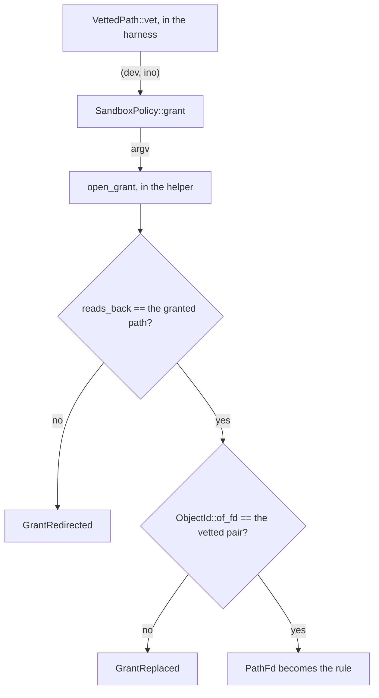

# A claim is only as large as its scope sentence

[04 — the architecture](04-the-architecture.md) closes on its third view: six
named boundaries, each one a shape in Rust. This chapter stands inside that view
and turns around. Not how a boundary is built, but what
[`SECURITY.md`](../../SECURITY.md) promises about it — and, the half that takes
longer to read, what it declines to promise.

That document is normative and this one is an on-ramp; where the two disagree,
it is right. It is also written to be *exact* rather than to be entered, which
is the gap this chapter fills. Read end to end once, with the scope sentence and
the non-claims weighted as heavily as the table between them, it teaches
something worth more than its contents: how to find the sentence that makes a
claim smaller than it first reads.

## Start above the table, not at it

Ten rows of control and mechanism sit under one sentence, and every row inherits
its three conditions. Paraphrased, because the first of them is a figure this
chapter may not restate:

- **Linux, at or above the Landlock floor.** The floor has one home in the code,
  `BASELINE_ABI` in
  [`ruleset/compat.rs`](../../crates/sandbx-core/src/helper/ruleset/compat.rs),
  and `SECURITY.md` carries the figure in prose. Below it the run is refused, so
  the condition is never quietly false — see [01](01-what-sandbx-is.md) for why
  a floor and not a preference.
- **With unprivileged user namespaces available.** A host that forbids them is
  refused too: the PID namespace that bounds a command's descendants needs one
  whatever else the policy asks for.
- **For a command run through `SandboxedCommand`.** The condition that does the
  most work and announces it least. `SandboxedCommand` is the *spawning* path —
  04's three processes — and exactly one of the seven built-in tools reaches it.

What that third condition leaves outside is most of the program:

| outside the scope sentence | what bounds it instead |
|---|---|
| the harness process | nothing confines it; one step hides it, below — and `SECURITY.md` says so as a non-claim |
| the helper's supervisor stage | nothing; it has to be able to spawn the stage that installs the ruleset |
| `read`, `write`, `edit`, `ls`, `grep`, `find` | `FsGuard`, in-process |
| `hash` and `auth` | nothing — neither confines anything ([01](01-what-sandbx-is.md)) |
| anything linked into the binary | nothing; a dependency runs with the harness's privileges |

Two of the five properties further down reach past the scope sentence on purpose
and name `FsGuard` in their own text. The claim table does not.

- **Worth questioning:** the table is where a security reader starts, and read
  on its own it says "Landlock" over a product in which six of seven tools never
  reach Landlock. The project knows this precisely —
  [decision-enforcement-seam.md](../decision-enforcement-seam.md) opens with
  "there are **two** seams, not one, and most tools only cross the first" — so
  the objection is not to the design but to where the fact is kept. One clause
  in the scope sentence, naming the in-process layer beside `SandboxedCommand`,
  would cost a line and remove the one misreading of this document that a
  careful reader can still reach honestly.

## The claim rows, one at a time

Each row is three things: what is promised, by what mechanism, and what the
promise covers and does not. The third is the part a reader skips.

### Filesystem, and the entry point

- **Filesystem — a Landlock ruleset.** Promised: reads, writes and execution
  bounded by path, each granted separately. The mapping from a policy's axes
  onto Landlock access bits is `rights_for` in
  [`ruleset/rights.rs`](../../crates/sandbx-core/src/helper/ruleset/rights.rs),
  and it is written as subtraction rather than enumeration — a write grant is
  everything the ABI handles *minus* the read set. Read that direction carefully:
  a right a future ABI adds lands in `from_all` and so joins *every* write grant
  until somebody subtracts it by hand. `ResolveUnix` at V9 arrived exactly that
  way and is now subtracted by name (#259); `IoctlDev`, device ioctls on a node
  beneath the path, is one such right already in the set. Covers paths; says
  nothing about what a granted program does
  with what it reaches. Does not cover the six in-process tools, per the scope
  sentence.
- **Entry point — a SHA-256 over a descriptor.** Promised, only when
  `--pin-sha256` names a digest: the bytes of the one program sandbx `execve`s.
  `open_verified` in [`digest.rs`](../../crates/sandbx-core/src/digest.rs) opens
  the program, hashes the handle, and hands back *that descriptor* to be exec'd,
  so no path is resolved a second time between the check and the `execve`.
  Covers one image. Does not cover what the image then spawns, and two shapes a
  pin cannot cover at all are refusals rather than silent passes: a `#!` script
  (`starts_with_shebang` — the kernel would hand the interpreter a path naming a
  descriptor closed by then) and a program granted execute but not read.

### Network, and name resolution

- **Network — an empty namespace, or port rules plus a seccomp backstop.**
  Promised: with no network grant, no IP egress at all and no abstract unix
  sockets, because `isolate` in
  [`hardening.rs`](../../crates/sandbx-core/src/helper/hardening.rs) adds
  `CLONE_NEWNET` and there is no interface to send on. With a port allowlist,
  connect and bind narrowed to the listed TCP ports. Covers the *port*. The
  mechanism is why: Landlock's network rules match a port and seccomp cannot
  follow the pointer behind `connect`'s address, so there is no layer that sees
  a destination (#145).
- **Name resolution — three read-only bind mounts.** Promised, with
  `--allow-dns NAME`: the files every resolver reads, replaced inside the
  command's own mount namespace. `bound_resolution` in
  [`helper/resolver.rs`](../../crates/sandbx-core/src/helper/resolver.rs) makes
  `/` private and recursive first, then binds a `hosts` sandbx resolved before
  the command started, an `nsswitch.conf` with no `dns` source, and a
  nameserver-less `resolv.conf` from a tmpfs it then detaches rather than
  unlinks. Covers which *names* resolve — an unlisted one fails immediately
  rather than by timeout, with no nameserver left to ask instead. Covers nothing
  about which hosts are reachable: an IP literal walks straight past it.

  The four shapes that would leave a reachable nameserver answering for every
  name are refusals, and they are decided on `SandboxPolicy` itself —
  `unbounded_resolution` in
  [`policy.rs`](../../crates/sandbx-core/src/policy.rs) — rather than in the
  CLI, so an embedder building a policy by hand meets them too.

### Unix sockets, and the environment

- **Unix sockets — two seccomp rules, and one Landlock right where the kernel
  has it.** Promised: a unix socket that reaches anything outside the sandbox is
  denied unless granted — `socket` with `AF_UNIX` in argument zero, and a
  connectionless `socketpair(AF_UNIX)`, which reaches a descriptor without
  calling `socket` at all. Both gated on `allows_unix_sockets()` independently
  of any network grant. **Read the "what it bounds" cell closely, because it is
  narrower than the obvious reading and says so twice.** It is not "may open one
  at all": a *connected* `socketpair` is left permitted, and the row names it so
  the gap is not read as an oversight — both halves are inside the sandbox and
  neither can be re-aimed at a host socket ([10](10-seccomp.md) has the kernel
  state that makes that true). And *which* pathname socket may be dialled is
  bounded by the filesystem policy at Landlock ABI V9 only, where the flag
  confers `ResolveUnix` on the paths it granted ([09](09-landlock.md)); below
  V9, which is every kernel shipping today, nothing bounds it and a socket whose
  path the command knows is reachable with no grant naming it. That limit has
  its own non-claim below.
- **Environment — `env_clear`, a name allowlist, then the imposed constants.**
  Promised: everything the policy neither names nor imposes is dropped, at every
  spawn stage. The row is careful about the difference: the allowlist governs
  what the command *inherits*, and `imposed_env` is a set of compile-time
  constants added after it, so the environment is not the allowlist alone. This
  is the one bound
  none of the three kernel primitives can reach, because the kernel hands the
  environment over during `exec` before any filter the new image installs has a
  say. So it is enforced by never putting it there, in
  [`spawn.rs`](../../crates/sandbx-core/src/spawn.rs):

```rust
command.env_clear();
command.envs(
    policy
        .allowed_env()
        .iter()
        .filter_map(|name| std::env::var_os(name).map(|value| (name.clone(), value))),
);
// After the allowlist, so a name carried both ways arrives with the policy's value.
command.envs(policy.imposed_env().iter().copied());
```

`clippy.toml` bans `std::process::Command::new` workspace-wide and `command`
here holds the single exemption, so narrowing is a property of *construction*
rather than a call each spawn site must remember. Covers which variables cross.
Says nothing about the value of one that does.
[decision-environment-allowlist.md](../decision-environment-allowlist.md)
records why there is one builder and not a clear at each spawn site: with four,
each of the four was unfalsifiable, because deleting any one left a later one
covering for it and the command's environment byte-identical.
[05](05-seven-crates.md) is where that argument is traced through the lint.

The other half of *at every spawn stage* is a check, not a clear. Before
applying anything, `restrict_and_exec` in
[`helper/mod.rs`](../../crates/sandbx-core/src/helper/mod.rs) refuses outright
if the environment stage 2 *inherited* holds a name the policy does not permit —
`permits_env`, the one predicate the factory and the check share, being the
allowlist plus the single compile-time pair `imposed_env` carries under
`--dns-over-tcp`. Clearing again would answer with silence, the command's
`environ` coming out identical either way; refusing says whether the stage above
went through the factory at all.

### Syscalls

- **Syscalls — seccomp-bpf, as a denylist.** Promised: process inspection and
  descriptor theft, namespace manipulation and creation on every route,
  reshaping the filesystem under Landlock by name and by descriptor, loading
  code into the kernel, the keyring, `io_uring`, `userfaultfd`, `memfd_create`,
  whole-host state — and a foreign architecture killed rather than
  refused per call, its syscall numbers meaning something else. Both the row and
  [10](10-seccomp.md) group by what a group would buy an attacker, but they do
  not group identically — the row's six groups are coarser than the chapter's
  eight, which splits the keyring off from kernel code loading and moves
  `userfaultfd` beside `io_uring` as the other way to act without issuing a
  syscall. Neither grouping is the filter; the list is. The
  unconditional entries are one list, `BLOCKED_SYSCALLS` in
  [`seccomp/rules.rs`](../../crates/sandbx-core/src/helper/seccomp/rules.rs);
  `blocked_syscalls` then adds the conditional rules a policy earns — the
  per-flag `clone` denials from `NAMESPACE_CLONE_FLAGS`, and the socket rules a
  port allowlist needs. Three stacked filters on x86\_64 and two
  elsewhere, because a seccompiler filter
  carries one action and two rules need a different one: `EPERM` for the list,
  `ENOSYS` for `clone3` so a threaded program falls back onto the filtered
  `clone`, and kill for x32 (#117). The kernel takes the most severe verdict
  across all three, so install order means nothing.

  A denylist is the part to be honest about. It covers the routes somebody
  enumerated; it is not a statement about everything else.
  [guide-sandboxing.md](../guide-sandboxing.md) sets out the three rungs of
  evidence behind it, strongest first, and which rung covers how many entries.

### Process state, lifetime and signalling

- **Process state — prctl, rlimit, capset.** Promised: `no_new_privs`,
  `RLIMIT_CORE=0`, and empty effective, permitted, inheritable and ambient
  capability sets. `harden_process_state` in
  [`hardening.rs`](../../crates/sandbx-core/src/helper/hardening.rs) drops the
  four hard, propagating a failure. The *bounding* set is the fifth and is
  best-effort, which is a non-claim below rather than a footnote on this row.
- **Process lifetime — a PID namespace plus `PR_SET_PDEATHSIG`.** Promised:
  every process the command spawned dies when the call ends, including one that
  called `setsid`. Two independent paths, because a command can leave the
  process group and `pdeathsig` does not care about group membership —
  [guide-process-lifetime.md](../guide-process-lifetime.md) has the chain and
  the one ordering rule inside it (arm, *then* confirm).
- **Process signalling — the PID namespace.** Promised: a command cannot signal,
  or even name, a process outside its own namespace. This row is free; it falls
  out of the namespace the previous row already needed.

## The five properties matter as much as the ten rows

A row says what is bounded. These say how the bounding behaves when something
goes wrong, which is usually the question a reviewer actually has.

- **It fails closed.** A kernel that cannot enforce the baseline is refused, and
  so is a ruleset only *partly* applied — partial application is a hole, not a
  reduced sandbox. `negotiated_abi_from` in `ruleset/compat.rs` walks
  `NEGOTIABLE_ABI` down from the newest level to the floor looking for the
  newest the kernel takes in full, under a hard requirement, and steps down on
  exactly one error: the one that means "this kernel does not handle these
  accesses". Any other error refuses, because stepping down on it would hand
  back a lower level than the kernel has and leave every right above it
  *unhandled* — which Landlock leaves unrestricted everywhere. Then
  `enforcement_verdict` is total over the ruleset-status enum, so a variant a
  future library release adds fails to compile rather than landing in an
  accepting arm.
- **It is default-deny at the library level, which is the level that is a
  boundary.** `SandboxPolicy` derives `Default` over empty vectors and
  `NetworkPolicy::Denied`, so a constructed policy grants nothing at all —
  environment included. The CLI is a convenience layer on top, and it is the CLI
  that opts into the system executables, seven standard variable names, and,
  with *no* path flag, read **and write** on the working directory. Nothing an
  embedder constructs inherits a CLI default. This is why "what does sandbx
  grant by default" has two answers and the honest one is "which sandbx?".
- **Grants do not widen each other, with one named exception.** `Axis::grants`
  in `policy.rs` is the single statement of what each axis confers, in booleans
  that no enforcement layer owns:

```rust
let (read, write, execute) = match self {
    Self::Read => (true, false, false),
    Self::Write => (false, true, false),
    Self::ReadExecute => (true, false, true),
};
```

The asymmetry runs one way: `ReadExecute` confers read, because a program needs
execute on the binary *and* read on the libraries its loader pulls in, and no
grant confers execute. Write confers neither, so a write-only drop directory
stays unreadable — on both enforcement layers, since `FsGuard::new` sorts the
same table's answers into its own two lists. That is per *grant*: the CLI
deliberately makes two grants for `--allow-write`, and
`SandboxPolicy::allow_write` alone is narrow.

- **What sandbx keeps for itself is out of a grant's reach.** Two paths are the
  harness's rather than the project's: the session transcripts a resumed run
  replays to the model, and the credential file `auth login` writes. A path
  grant reaching either is refused, in either direction, on every path axis and
  on both run subcommands, *without asking whether anything is stored there* —
  so the verdict comes from argv and is reproducible on any host. The same key
  reached through procfs is closed by a different mechanism:
  [`concealment.rs`](../../crates/sandbx-core/src/concealment.rs) clears the
  harness's own dumpable flag at startup, so `/proc/<harness-pid>/environ` is
  refused even to a reader running as you (#192) — which is what keeps an
  exported provider key out of a tool granted `/proc`.
  [decision-harness-owned-paths.md](../decision-harness-owned-paths.md) is where
  the choice between refusing and hiding is made, and why subtraction — grant
  the tree, carve out the file — was never available: Landlock composes rules by
  union and has no exclusion form.

  That clearing is the only step sandbx takes against its *own* process, and
  `SECURITY.md` carries it in this property and under *Not vulnerabilities*
  rather than as a table row — the cost named there being that sandbx dumps no
  core and `gdb -p` against a running one is refused. A same-thread-group reader
  stays exempt for `fd/` and `exe`, and an `execve` resets the flag regardless,
  so neither `digest` nor the readback in the next property is affected.
- **The path a grant was vetted as is the path the kernel is told about.**
  Policy is judged in the harness and the rules are opened in the helper, which
  is a window a symlink can be redirected in. `VettedPath::vet` is the only
  producer that touches the filesystem, it runs in the harness, and it carries
  the `(dev, ino)` pair it measured; `SandboxPolicy::grant` takes nothing else,
  so an unpinned grant is a compile error rather than a run that would not
  start. In the helper, `open_grant` in
  [`ruleset/opened.rs`](../../crates/sandbx-core/src/helper/ruleset/opened.rs)
  is the one way the crate obtains a `PathFd`, and it asks two different
  questions:

```rust
let opened = reads_back(&fd)?;
if opened != target.path() {
    return Err(SandboxError::GrantRedirected {
        granted: target.path().to_path_buf(),
        opened,
    });
}
```

The readback asks whether the name still leads where it led. The object check
underneath it — `ObjectId::of_fd` against the vetted pair — asks whether the
thing at the end of it is the same thing. Neither subsumes the other: a
`rename(2)` putting one real directory where another was vetted leaves the
spelling identical, and only the pin sees it. `FsGuard` asks the pin's question
for itself, re-measuring a matched root through an `O_PATH` descriptor at every
access, so the two layers answer a substituted root alike whether or not a
process was spawned.

Both questions in series, with the crossing between the two processes in the
middle and a refusal of its own behind each one:



## The non-claims, by theme

`SECURITY.md` lists these in the order they were written. Grouped, they are
easier to hold, and the grouping is itself the lesson: most of them are one of
seven recurring shapes.

### What is not inside the boundary at all

The harness is not sandboxed — a vulnerability in sandbx's own code is not
contained by sandbx. Nor is the helper's supervisor stage, structurally: it must
spawn the stage that installs the ruleset. Nor is a dependency, which runs with
the harness's privileges rather than a tool's. And the boundary is enforced by
convention plus tooling, not by a capability system: `unsafe` is forbidden
workspace-wide and spawning outside `spawn::command` is a clippy error, but a
determined contributor can add raw syscalls.

The helper itself is reached by inode — the re-exec goes through
`/proc/self/exe`, so a replacement renamed over the binary's path cannot
redirect the next spawn, and `ETXTBSY` blocks an in-place overwrite while it
runs. Two limits come with that, and the second is the one to sit with:
replacing the binary still reaches the *next* invocation of `sandbx`, and
nothing refuses a derived default in the directory holding the binary — so a
no-flag run from a user-level install prefix grants write there.

- **Worth questioning:** that last sentence is the one harness-owned path no
  refusal covers, and the property above says harness-owned paths are refused
  from argv on both subcommands.
  [decision-default-policy.md](../decision-default-policy.md) settled it and is
  explicit about the residue — the path guard it removed was "comparing a name
  nothing is reached by", a carve-out is impossible, and the arm was the one
  that fired in ordinary use, including on sandbx's own developers in their own
  repo. All of that is about the *spawn inside this run*, which the inode
  closes. The residue is a different hazard with a different actor: a human
  running `sandbx` again tomorrow, reached entirely by name. The existing
  derived-default guard already refuses six shapes by location and is decidable
  from argv plus `/proc/self/exe`, which is exactly the test
  [decision-harness-owned-paths.md](../decision-harness-owned-paths.md) sets for
  a refusal. Its own framing — the two on-disk roots are the harness's, not the
  project's — seems to reach the installed binary as readily as it reaches the
  session store, and the record does not weigh it in those terms. The cost is
  real and should be named with the objection: a further arm takes the no-flag
  run away from anybody who installed to `~/.local/bin` and works there.

### Identity is measured, not held

`FsGuard` measures a granted root and *then* performs the access beneath it, so
a substitution landing between the two — of the root, or of a parent directory a
walk reopens by path — is granted on the object the measurement
saw. Two swaps stay open, two adjacent syscalls wide across the four
single-path tools — five guard calls between them, `edit` confirming twice — and
the whole traversal for `find` and `grep`, whose walk confirms its root once and
then descends; both close the same way, by running the access off a directory
descriptor with `openat2(dirfd, …, RESOLVE_BENEATH)` for every step below it
(#230). The bare `check_read` and `check_write` bound nothing after the
measurement at all, which is why no tool calls them — the tools take a handle
where one exists, via `open_read` and `open_write`. `read_dir` and
`walk_readable` have none: a directory read has no `O_NOFOLLOW` handle form, so
`ls` reads the path again and every directory below a walk root is reopened by
path. That is the wider half of what #230 closes.

Two floors sit under the pin itself. An inode number is free once what held it
is unlinked, so a granted directory deleted and re-created can compare equal on
both layers although nothing the harness judged survives; telling that from a
swap needs a creation time or a generation number beside the pair. And a
filesystem with no backing block device takes an anonymous `st_dev` allocated
fresh per mount, so a granted tree on a network or autofs mount that remounts
mid-session starts refusing until the policy is rebuilt — an honest false
positive, and the direction a sandbox should fail in.

### A grant reaches further in time than it looks in space

Write access to a project tree is write access to what you run in it next. A
granted tree almost always holds files that execute outside the sandbox later,
under your own account: `.git/hooks/*`, `.git/config`, `.cargo/config.toml`, a
`Makefile`, `package.json` scripts. The next ordinary `git commit` or
`cargo build` runs what a tool rewrote, unconfined. Nothing is refused and
nothing can be, because it waits on a human action.

A pin has the same shape in miniature: it covers the entry point, not the code
the run executes (#146). After that one `execve` a pinned program may spawn
anything the filesystem policy permits — a pinned `/usr/bin/python3` being the
plain case, the digest fixing the interpreter and not the script it is handed.

And standing in a system directory is not refused by name. The derived default
refuses the trees it grants execute on; `/etc`, `/var`, `/proc` and `/sys` it
does not, because depth is not sensitivity and a list of dangerous directories
has a silent first omission. What is refused instead is a grant reaching a path
sandbx itself owns — a statement about sandbx's own state, not a list.

### Where the control is coarser than the question

A port allowlist is not a destination allowlist: `--allow-network 443` bounds
egress to port 443 on *every* routable host (#145). Per-host would need a
userspace proxy terminating every connection, and
[decision-egress-proxy.md](../decision-egress-proxy.md) prices five pieces of
one and declines four — interception is cooperation, not enforcement. Two
further sentences make that row smaller than it reads, and they are the worked
example of this whole chapter:

- **It costs more than it looks.** The claim holds only if everything Landlock
  cannot police is shut, so under a port list seccomp also denies UDP, raw
  sockets, stream sockets on another protocol or in a family that tunnels IP
  inside the kernel, `setsockopt(TCP_ULP)` and TCP Fast Open. So name resolution
  fails under `--allow-network <port>`, as do QUIC, HTTP/3, `ping` and
  in-process kTLS.
- **It is not uniformly narrower than withholding network.** `bind` is refused
  on every unlisted port, `bind(0)` included, so a program standing up a local
  listener on an ephemeral port works under the default policy and fails here. A
  port list also puts the command in the *host's* network namespace — a port
  rule inside an empty one has nothing to permit — so host loopback is reachable
  on an allowlisted port, and the host's abstract unix socket namespace is no
  longer isolated by the netns. Narrower on remote ports, wider on what is
  local.

Unix sockets are all-or-nothing for the same kind of reason:
`--allow-unix-sockets` grants *every* pathname socket the command can reach — an
ssh-agent, a docker socket, the session bus — because seccomp cannot follow the
pointer to `connect`'s path and Landlock gained a path-scoped right only at a
level not available in practice. The denial it lifts covers both routes to an
`AF_UNIX` descriptor, `socket` and a connectionless `socketpair`, the second
reaching one without calling the first. What is missing below Landlock ABI V9 is
not a narrower flag but a *traversal right*: nothing sandbx installs conditions
a unix `connect` on a path grant, so a hardcoded `/run/docker.sock` is dialable
holding no grant that names it, and the filesystem policy does not bound it. At
V9 the flag confers `ResolveUnix` on the paths it granted, and then — and only
then — what the command may reach bounds what it may dial. Every kernel shipping
today is below V9. Under a port allowlist the flag lifts one thing more: the
netns no longer isolates the host's abstract socket namespace, so the two
`AF_UNIX` denials were the only layer left in front of it.

A variable you pass through is passed in full: the allowlist is by *name*, so
`--allow-env GH_TOKEN` hands over the value the harness holds, verbatim, and
every process the command spawns inherits it. Sharing a secret without exposing
its value has no mechanism —
[decision-tool-credentials.md](../decision-tool-credentials.md). Exactly one
name is refused rather than passed, and the refusal is narrower than it sounds:
an agent subcommand refuses `--allow-env ANTHROPIC_API_KEY` because sandbx makes
the provider call in-process, by the one name it reads as a credential rather
than by a pattern, and `sandbox-run` still passes it. It closes the
`--allow-env` route only.

The policy itself is visible to the command. It crosses into the helper as argv,
and the helper's `/proc/<pid>/cmdline` is readable from inside the sandbox, so
the granted paths and the allowlisted variable *names* are too. Only
names travel that way, never values — which is why `--allow-env` takes a name
and not a `NAME=VALUE` pair. Policy is a boundary, not a secret.

Denying `memfd_create` is the one row in this group where the denial is not the
control. It is blocked because an anonymous in-memory file has no path for
Landlock to match on, but a descriptor obtained another way still runs via
`/proc/self/fd/N` with an ordinary `execve`. What bounds that is Landlock's path
rules — execute comes only from `allow_read_execute` — not seccomp. A pinned run
relies on exactly that: Landlock dereferences the magic link, so execing the
hashed descriptor is checked against the program's real path and needs no
`/proc` grant.

### What is on your disk, and who it is protected from

A saved session is a plaintext transcript. `--session` writes the whole
conversation — your prompts, the model's replies, every tool call's arguments
and every tool's output — as JSON lines under a state directory. Whatever a tool
read is in it: a token in a config, a `.env` under `--allow-read`, a key a
`bash` printed. No encryption, no redaction, no expiry, no deletion. Ownership
and integrity are enforced, not secrecy: `0700` on the directory, `0600` on the
transcript, a wider directory narrowed, and a resume refused when another user
can write or owns either. One another user can merely *read* resumes with a note
on stderr, because the disclosure has already happened and a conversation cannot
be rotated (#173). What stays unprotected is a *copy* — a transcript you move
into a granted tree, or another program of yours reading it. A turn stopped on
`tui`'s screen writes nothing at all, not even the part of the answer you read —
an interrupt and a hung-up terminal discard it alike — while a tool call already
running still finished (#271).

A stored credential is protected from other users, not from the agent.
`auth login` writes the key `0600` in a `0700` directory and refuses to *read*
it when any group or other bit is set on either — a directory another user may
write is one they can substitute a credential in. The mode is part of the claim:
a too-wide file is refused and named rather than quietly `chmod`ed back, because
it was already disclosed and the fix is to rotate the key. `auth logout` is the
single exception, reading a too-wide file rather than refusing — a refusal there
would leave the disclosed key on disk. It is not encryption:
the key is plaintext, readable by your own uid and by root, held by the harness,
which is not sandboxed. Storing it removes exactly one exposure — a key in the
file is not in the harness's environment, so no `--allow-env` has it to hand
over (#184). An OS keyring would not change what remains, and
[decision-credentials.md](../decision-credentials.md) declines it outright
rather than deferring it.

### Asked, not enforced — and bounded, but not by much

Approval is not enforcement, and by default it is per tool per run (#165). A
gate sits between the model asking for a tool and `sandbx-tools` running it, and
both agent subcommands answer it from the flags you typed: the four read-only
tools run, while `write`, `edit` and `bash` come back refused until
`--allow-tool` names them. Under `--approve run`, the default, nothing is asked
in between — once a tool is approved, every call to it in that turn runs,
including one a prompt injection induced. `--approve call` asks on your terminal
before each write and each command, shows the arguments the model chose cut at a
fixed width so the tail of a longer command is not shown (#169), and refuses to
start where there is no terminal to ask on. It is refused outright under `tui`,
the screen having taken the terminal that question wants (#225). A terminal that
goes away *during* a run is fail-closed and noticed: the read fails rather than
returning an answer, that call and the ones behind it are refused, and the
process exits 3 rather than 0 (#218). Under `tui` nothing is being asked, but a
terminal that hangs up is a turn nobody is watching, so it ends the turn and
exits 3 on the same reasoning — the screen or the keyboard, either one (#264). A
command line sandbx would not take exits 64 instead, before a turn or a sandbox
exists, so none of these codes is reachable by mistyping a flag (#265).

The sentence to carry out of that row:
[decision-approval-gate.md](../decision-approval-gate.md) draws the line as the
gate narrowing *which* tools a hijacked turn can use, while only the sandbox
bounds *where* an approved one reaches.

Only a spawned command's wall-clock time is bounded. `bash`'s command is killed
if it outruns its limit and `sandbox-run` takes an opt-in `--timeout`; the other
six run in-process, untimed, bounded by *work* instead — a cap on files visited
and bytes read for `grep` and `find`, the single file or directory for the rest
([decision-bounding-tool-work.md](../decision-bounding-tool-work.md)) — on a
thread that cannot be cancelled, so one read on a stalled filesystem hangs
indefinitely. Nothing else is capped: no CPU bound, no memory bound, no limit on
processes spawned. A fork bomb is unbounded while the call lasts; what *is*
bounded is that it does not outlive it. And a running tool call cannot be
interrupted at all — only its own deadline stops it (#26).

One bound in this section is deliberately *not* a containment claim, and the
document says so rather than leaving a reader to infer it. A turn is bounded:
`TurnLimits::max_rounds` caps the requests one turn may make of the model, and
`TurnLimits::stream_timeout` how long one of them may spend streaming
([guide-turn-loop.md](../guide-turn-loop.md),
[13](13-turn-loop-and-gate.md)). But what those bound is sandbx's own loop, not
anything a sandboxed command can reach — so they belong with the non-claims and
not in the table, which is the distinction the scope sentence drew at the top of
this chapter.

### Where a mechanism is weaker than its name

The capability bounding set is cleared best-effort, not guaranteed. Dropping it
needs `CAP_SETPCAP`, which an LSM may strip from a user namespace an
unprivileged process created — AppArmor's `restrict_unprivileged_userns` does,
so there the bounding set stays as inherited. `drop_bounding_set` records a
`degraded` decision on the audit trail at `INFO`, so you need not have opted in
to see it, and carries on rather than refusing: the bit cannot be spent, since
with the other four sets empty and `no_new_privs` set the kernel will not let an
`execve`d binary raise a capability. Do not rely on `CapBnd` being empty; do
rely on the other four.

The sandboxed command is not marked non-dumpable. The kernel resets
`PR_SET_DUMPABLE` to dumpable on every `execve` of an ordinary binary, so the
helper does not set it at all — the flag that *is* set belongs to sandbx's own
process, by `conceal_process_state`, a different process in a different section
of the document. `RLIMIT_CORE=0` does persist across `exec`, so core dumps stay
suppressed; the ptrace-attach protection is not achievable here, and it costs
the command nothing because the command's environment holds only what
`--allow-env` named plus the `imposed_env` constants, none of them secret.

`/proc` inside the sandbox shows host PIDs. It is not remounted for the new
namespace, since that needs `mount(2)`, which the filter denies — so a command
reads `getpid() == 1` while `/proc/self/stat` reports its host pid, and one
building `/proc/<getpid()>` by hand reads a different process. A compatibility
limitation, not a claim about the boundary.

An unhandled signal aimed at the command itself is ignored. The command is PID 1
of its namespace and the kernel discards a default-disposition signal sent to a
namespace's init, so `kill -TERM` at the command does nothing unless it
installed a handler. Kernel-raised faults such as `SIGSEGV` are still delivered,
and sandbx's own kill is unaffected: it targets the supervisor with `SIGKILL`,
which an operator killing one by hand should target too.

## Two sections it is easy to skip

**Known weaknesses** is public on purpose — a sandbox that hides its gaps is
worse than one that names them — and it currently records none known that let a
command reach outside the boundary, pointing instead at a label. Read that
together with the non-claims rather than instead of them: a non-claim is not a
weakness, it is a boundary drawn where the mechanism ends.

**Not vulnerabilities** is the complement, and it is where a careful reader goes
first when something surprising happens. It is also where several claim rows get
their final narrowing. The lifetime row promises that every process the command
spawned dies when the call ends; the last bullet of *Not vulnerabilities* is the
sentence that makes that smaller, naming the one shape in which a descendant
survives — the command both having had its parent death signal cleared by a
secure `exec` *and* having called `setsid` to leave the process group — and then
narrowing the consequence as well: a survivor is still fully confined, Landlock,
seccomp and the namespaces being irreversible and inherited, so it is unreaped
rather than unrestricted.

## Reading one honestly

Three habits, in the order they pay off.

- **Find the scope sentence before reading a single row.** A claim table with no
  scope is a marketing table. Here the scope is three conditions, and the third
  of them decides which of seven tools the table is about.
- **Treat the non-claims as part of the claim.** They are not caveats bolted on;
  several of them are the only place a row's real size is stated. *A port
  allowlist is not a destination allowlist* is longer than the network row it
  qualifies, and it has to be.
- **When the mechanism and the claim disagree, that is a finding, not a note.**
  [`CLAUDE.md`](../../CLAUDE.md) requires one of them to change — the claim is
  weakened, or the mechanism widened to match — so drift goes to the maintainer
  rather than into a document. That is also the rule that makes this chapter
  checkable: every row above was read against the code, and the code is linked
  so you can do it again.

## You should now be able to explain

- What the scope sentence's three conditions are, and which of the seven
  built-in tools the claim table is actually about.
- Why a write grant confers neither read nor execute, which single axis confers
  two things, and why that one exception exists.
- What "fails closed" means mechanically, in terms of what stepping down on the
  wrong error would leave unhandled.
- Why `SandboxPolicy::default()` grants nothing while a no-flag `sandbox-run`
  grants several things, and why both statements are true at once.
- The two different questions `open_grant` asks of a granted path, and which
  substitution each one catches that the other misses.
- Why a port allowlist is in one respect narrower and in another wider than
  withholding the network entirely.
- What a saved transcript is protected against, and what it is not.
- Why "the harness is not sandboxed" is a non-claim rather than a weakness, and
  which single step sandbx does take against its own process.
- Why the environment claim says *at every spawn stage*, and which stage refuses
  rather than clears.

## Next

[07 — the kernel primer](07-kernel-primer.md), which supplies the vocabulary the
claim table spends and names almost none of this repo's own code. The chapter
that picks up where this one leaves off is the last one,
[17](17-gaps-and-open-questions.md): the non-claims above, plus the gaps nobody
has written into that document, each paired with the issue or the decision
record that holds it.
