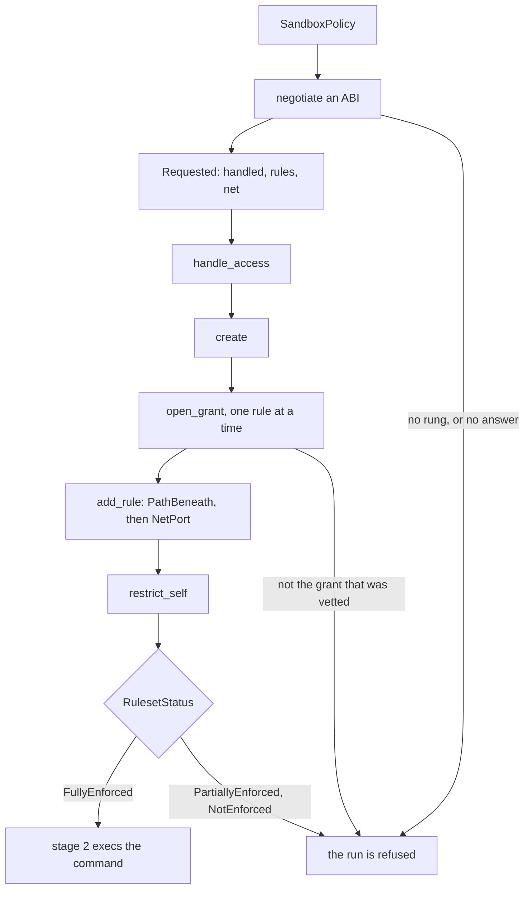
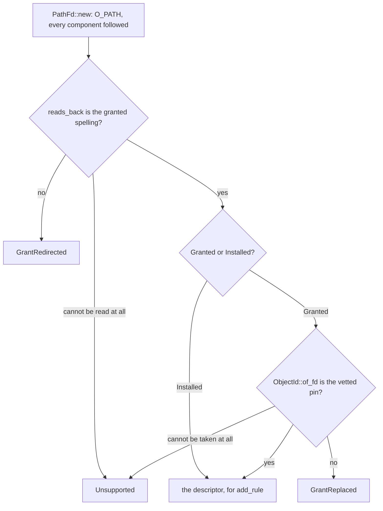

# A grant becomes a Landlock rule, or the run is refused

One box of [04 — the architecture](04-the-architecture.md), zoomed all the way
in: the `bash` tool's `SandboxedCommand`, inside stage 2, where `apply()` turns
a `SandboxPolicy` into something the kernel holds. Six of the seven built-in
tools never arrive here at all — they end at `FsGuard`.

This chapter is the Landlock half of that box. How an ABI gets chosen, what a
grant confers once one is, and the two questions asked about every granted path
before the kernel is told about it. `apply`'s own ordering is not re-derived
here. [guide-sandboxing.md](../guide-sandboxing.md) is the authority for the
subsystem and [`SECURITY.md`](../../SECURITY.md) is the normative claim; both
carry the figures this chapter deliberately does not.

[`helper/ruleset/`](../../crates/sandbx-core/src/helper/ruleset/) is four files
with one job each, and its module doc states the division: `compat` is what
*this kernel* will enforce, `rights` is what the *policy* maps to at a given
ABI, `opened` is which directory a grant turns out to name, and `mod.rs` is
where the first two meet — because the rights a grant confers depend on which
ABI was negotiated. Nothing in any of the four restricts the calling process.

Those four files add up to one path, and it is the spine of this chapter.
Nothing is restricted until `restrict_self`, so everything above it is a
description the kernel has not acted on yet — and three separate steps can end
the run on a judgement of their own instead. They are the three edges below;
every library call on the path can additionally fail on its own error, each
`?`-propagated as `SandboxError::Landlock`, which is a refusal too but not a
decision this code makes:



## The ladder is walked newest first and stops at the floor

[`compat.rs`](../../crates/sandbx-core/src/helper/ruleset/compat.rs) holds three
constants and nothing else decides which ABI a run gets. `LATEST_ABI` is the
top, `BASELINE_ABI` is the floor, and `NEGOTIABLE_ABI` is the ladder spanning
them — both bounds included, not just the rungs between — written out newest
first. Written out rather than generated because
`landlock::ABI` is a closed enum with no iterator and no arithmetic — and a
literal ladder is the thing an ABI bump is forced to edit, beside the two
constants that bound it.

This chapter names those constants wherever a number would go.
[`SECURITY.md`](../../SECURITY.md) and
[guide-sandboxing.md](../guide-sandboxing.md) hold the floor and the kernel
release it shipped in, and the test `every_prose_copy_of_the_floor_is_current`
names every file allowed to restate them — a list these chapters stay off, on
the reasoning in [the index](README.md).

**Why there is a floor rather than a preference** is the one thing to carry out
of this section, and it is a property of Landlock rather than a policy choice:
an access type that is *not* in the handled set is unrestricted **everywhere**.
Not loosely held — not held at all. So an older kernel does not give a weaker
sandbox, it gives a sandbox with whole categories missing, and the sensible
response is to refuse.
[01 — what sandbx is](01-what-sandbx-is.md#what-the-kernel-has-to-provide)
quotes the comment on `BASELINE_ABI` that says so.

That is also why `handled_access` is `AccessFs::from_all(abi)` and not an
enumeration of the rights sandbx knows about. A right a future ABI adds lands
in the handled set automatically, and is therefore *denied* unless some axis
confers it. An enumeration would leave it unhandled, which means unrestricted,
until somebody noticed.

### The probe asks the question the real call will ask

`negotiated_abi` calls `negotiated_abi_from(kernel_probe)`, which walks
`NEGOTIABLE_ABI` in order and settles on the first rung the probe accepts.

`kernel_probe` builds a ruleset at `CompatLevel::HardRequirement` — "give me all
of this or fail" rather than Landlock's default best-effort — hands it
`handled_access(abi)` and `handled_net_access(abi)`, and calls `create()`.
Creating a ruleset is not applying one: nothing is restricted until `apply`
reaches `restrict_self`, so the whole ladder can be walked in a single process
with no re-exec and no child. And the probe and `apply` read their handled set
from the same two functions, one spelling each, so the probe cannot settle on a
rung by answering a question `apply` never asks.

| the probe answers | `negotiated_abi_from` does |
|---|---|
| `Ok(())` | settles on this rung and returns it |
| `Err(RulesetError::HandleAccesses(_))` | steps down exactly one rung |
| any other `Err` | refuses, carrying the kernel's own reason |
| nothing left below the floor | refuses as `Unsupported`, naming the floor |

**Only one error is an ABI verdict.** Under `HardRequirement`, `handle_access`
is the call that refuses a partly-supported set and names the rights this kernel
lacks, so `HandleAccesses` is the one answer that means "not this rung, try a
lower one". Every other error says nothing about which ABI the kernel has, and
stepping down on it would pick a rung for the wrong reason — leaving every right
above that rung unhandled, which is to say unrestricted everywhere. Landlock
being absent altogether still arrives as `HandleAccesses`, so it walks the whole
ladder and falls off the end.

The whole decision is three arms, and the one that steps down is a `continue`:

```rust
    for abi in NEGOTIABLE_ABI {
        match probe(abi) {
            Ok(()) => return Ok(abi),
            // …
            Err(RulesetError::HandleAccesses(_)) => continue,
            // …
            Err(error) => return Err(landlock_failed(error)),
        }
    }
```

Each `// …` is one of the two reasons above, written out at its arm. `break` is
the third answer and the wrong one: it leaves the loop and lands in the baseline
refusal the function ends with, which is the other of the two refusals below and
names the wrong cause. Which is why
`a_non_verdict_error_refuses_without_stepping_down` asserts the error *variant*
rather than `is_err()`, and why its probe accepts every rung *below* the failing
one. A probe that failed everywhere would pass under the very mutation that test
exists to catch — the correct code refusing with `Landlock`, the mutant walking
off the ladder to refuse with `Unsupported`, and both of them errors.

The two refusals are deliberately different errors. `Unsupported` names the
floor; `Landlock` carries whatever the kernel said. Collapsing them would report
the floor as the cause of a failure that had nothing to do with it. The pair is
pinned by `a_non_verdict_error_refuses_without_stepping_down` and
`a_kernel_below_the_baseline_is_unsupported`, both of which run on a host with
no Landlock at all, because `negotiated_abi_from` takes the probe as a
parameter.

### The network axis steps a rung the policy never asked for

`kernel_probe` hard-requires **both** axes, and is policy-independent in both.
So the one access category that can walk the ladder down on its own is the
network one: an unsupported `AccessNet` right comes back as the same
`HandleAccesses`, and a kernel missing it drops the run to a lower rung even
when the policy grants no network at all.

That is the point rather than a side effect, and the doc on `kernel_probe` says
why: a probe that skipped the network axis could settle on a rung whose network
rights `apply` then hard-requires — and by then the negotiation is over, so
there is no step-down left and the run is simply refused. Paying a rung in the
probe keeps the negotiated ABI a property of the kernel rather than of the run.
Both of `BindTcp | ConnectTcp` arrived below the floor, so the network set is
never empty here.

Whether the axis is handed over *at all* is a separate decision, made in
[`rights.rs`](../../crates/sandbx-core/src/helper/ruleset/rights.rs)'s
`net_rules`, and it is the one place in the ruleset where "nothing" and "an
empty list" differ: handling `AccessNet` with zero `NetPort` rules denies every
TCP port, while leaving the axis unhandled leaves TCP unrestricted. So a denied
policy and a bare `--allow-network` both map to `RequestedNet::Unhandled` — the
first confined by `CLONE_NEWNET` instead, the second having asked for
unrestricted egress — and only a port list maps to `Ports`. The enum exists so
that rights and ports cannot be passed separately, an empty
`BitFlags<AccessNet>` being exactly the fail-open spelling of `Unhandled`.

`Ports` then carries `handled` and `granted` as two fields rather than one, and
they are deliberately different sets: `handled` is `handled_net_access(abi)`,
while `granted` — what each port rule permits — is the literal
`BindTcp | ConnectTcp`. So a UDP or raw right a future ABI adds is policed on
every port and conferred on none, where taking `handled` for both would hand it
to every port the operator allowlisted.
`a_port_rule_grants_no_more_than_the_kernel_is_told_to_police` asserts the
containment rather than today's two literals, the claim being which way the sets
may differ; [guide-sandboxing.md](../guide-sandboxing.md) states the asymmetry
for both axes at once.

## Partial enforcement is a hole, not a smaller sandbox

`restrict_self` hands back a `RulesetStatus`, and `enforcement_verdict` is total
over it:

```rust
match status {
    RulesetStatus::FullyEnforced => Ok(()),
    RulesetStatus::PartiallyEnforced => Err(SandboxError::Unsupported {
        detail: "kernel enforced only part of the ruleset; some access type \
                 is unrestricted, so the sandbox would not hold",
    }),
    RulesetStatus::NotEnforced => Err(SandboxError::Unsupported {
        detail: "kernel accepted the ruleset but enforced none of it",
    }),
}
```

The detail string says the reasoning. `PartiallyEnforced` means Landlock left
some requested access type unhandled, and an unhandled access type is
unrestricted everywhere — so "partly applied" is not "most of the policy
applied", it is the whole policy plus one unguarded category. A sandbox with a
category missing is not a smaller sandbox.

Two things make that verdict possible rather than theatrical.

- **Negotiation asked for nothing the kernel had not already confirmed,** so
  full enforcement is the normal outcome and partial enforcement is an anomaly
  worth refusing. Asking for `LATEST_ABI` best-effort instead would have the
  kernel silently drop what it lacks, leaving every older kernel
  `PartiallyEnforced` — at which point the only way to run anything is to accept
  the status, and the check is gone.
- **The match is total rather than a comparison against one variant.**
  `status == NotEnforced` lets `PartiallyEnforced` through, and a variant a
  future `landlock` release adds would land in whichever arm was written as the
  accepting one. This is 04's recurring trick again: a closed enum plus an
  exhaustive match is a compile-time gate.

The asymmetry behind all of this is on `Requested` in
[`mod.rs`](../../crates/sandbx-core/src/helper/ruleset/mod.rs), and it is worth
reading once. A rule carrying rights *above* the handled set is caught:
`PathBeneath` narrows it, the ruleset comes back `PartiallyEnforced`, and the
verdict refuses. A rule *below* it is not caught by anything — every right the
newer ABI added is simply not granted, the policy promises more than the kernel
was told to allow, and no kernel-free test can see it. Which is why `handled`,
`rules` and `net` are computed together from one ABI in `requested_at`, and why
`Requested` is destructured by every consumer rather than read field by field: a
field added later fails to compile at `apply` instead of being quietly ignored.

## What a grant confers, as bit arithmetic

`landlock::AccessFs` is a `BitFlags` set, so the familiar operators do set
algebra: `!` is complement, `&` is intersection, `|=` is union-assign. The
landlock crate ships four named sets per ABI — `from_all`, `from_read`,
`from_write`, `from_file` — of which `rights_for` uses three, and it builds each
axis's rights out of them by **subtraction** rather
than by enumeration:

```rust
let read_rights = AccessFs::from_read(abi) & !AccessFs::Execute;
let write_rights = AccessFs::from_all(abi) & !AccessFs::from_read(abi) & !AccessFs::ResolveUnix;
```

Every subtraction there is load-bearing, and for a different reason.

- **Read is `from_read` minus `Execute`,** because the kernel's own read set
  bundles `Execute` in with `ReadFile` and `ReadDir`, and no axis but
  `ReadExecute` says *run*. Taking `from_read` as it comes would make
  `--allow-read` an execute grant.
- **Write is `from_all` minus the whole read set,** not minus `Execute` alone.
  `from_all` contains `ReadFile` and `ReadDir` too, so subtracting only
  `Execute` would confer read at the kernel while `FsGuard` refused it in
  process — and the write-only drop directory the policy advertises would be
  readable. **And minus `ResolveUnix`**, which is the one named subtraction on
  top of the two set-shaped ones: writing a file is not dialling a socket, and
  the bit is conferred from its own flag instead. The paragraph after next is
  why that line exists at all.
- **Subtraction rather than a list is what makes a future ABI fail safe.** A
  right added to `from_all` next year is denied by `allow_read` automatically,
  rather than being permitted until somebody notices it is not in the
  enumeration.
- **The same subtraction is what makes a future ABI arrive already granted on
  the write axis.** `from_all` minus `from_read` is open at the top end: a new
  right that is not a read right joins every `--allow-write` grant with no edit
  anywhere. At `LATEST_ABI` that has already happened twice, and both are rights
  beyond writing bytes — `IoctlDev`, device ioctls on a node beneath the path,
  and `ResolveUnix`, `connect(2)` to a pathname socket beneath it. Which is why
  `each_axis_confers_exactly_the_documented_set` spells all three axes' rights
  out literally, at both ends of the negotiable range, rather than deriving them
  from `from_all`/`from_read` — a derived expectation would move with the very
  bump it is meant to catch.

**The second of those two is the worked example of what the open top end
costs**, and it is the reason the subtraction list has a named bit on it. New at
V9 (Linux 7.1), `ResolveUnix` would have joined the write set with no line
edited, and `handled_access` being `from_all(abi)` means a V9 kernel handles it
too — so on the first V9 kernel `--allow-unix-sockets`, one boolean documented
as all-or-nothing, would have silently acquired a path condition: a pathname
socket would have to sit inside a *write* grant to be dialled, and a command
that works today would fail on a newer kernel with the same flags.

So it is subtracted from the axis and conferred from the flag instead, in
`unix_socket_rights`. Three things about that function are the whole of its
correctness:

- **It is masked by `from_all(abi)` and never compared against `V9`.**
  `PathBeneath::check_consistency` refuses a rule whose rights exceed the
  handled set, outside `CompatLevel` and so unconditionally — an unmasked bit
  would refuse *every* run on every kernel shipping today, which is the one way
  to get this wrong.
- **It rides on the grants and not on `RuleTarget::Installed`.** A resolver file
  is a bind mount of sandbx's own file that no grant names, and
  [`SECURITY.md`](../../SECURITY.md) and `policy.rs` both say "the paths it
  granted". Inert either way — `opens_as_itself` admits only existing
  non-symlink regular files, which hold no socket — so this is the claim and the
  mechanism agreeing rather than a hole being closed.
- **It is OR'd in after `rights_for`'s `from_file` narrowing, which does not
  re-widen it.** `ResolveUnix` is in landlock's own `ACCESS_FILE`, so a rule
  naming a socket inode directly keeps the bit.

What `SECURITY.md` gave up in the same commit is the sentence that read like a
mechanism and was an aspiration: "what the command can *read* bounds which
sockets exist to be dialled". Below V9 nothing sandbx installs conditions a unix
`connect` on a path grant, Landlock having no traversal right there, so the
claim is now the narrower true one — the filesystem policy bounds *which*
pathname socket at V9 only, and below it a socket whose path the command knows
is reachable with no grant naming it. That was measured, not assumed: dropping
the directory grants from `an_explicit_unix_grant_permits_the_connection` still
connects on a 6.18 host settling at V8. The claim weakened and the mechanism
widened in one commit, which is the move `CLAUDE.md` requires when the two
disagree.

Then the axis table decides which of the three primitives apply:

```rust
    let mut rights = landlock::BitFlags::EMPTY;

    if read {
        rights |= read_rights;
    }
    if write {
        rights |= write_rights;
    }
    if execute {
        rights |= AccessFs::Execute;
    }
```

`read`, `write` and `execute` there are the destructured fields of
`axis.grants()` — booleans, not Landlock bits, so the policy says what it means
in terms no enforcement layer owns. `Axis::Read` is `(true, false, false)`,
`Axis::Write` is `(false, true, false)`, and `Axis::ReadExecute` is
`(true, false, true)`: **the one grant that confers both**, and the only one
that confers execute at all. It exists because a program needs execute on the
binary *and* read on the libraries its loader pulls in.

Reading the arithmetic back, `read_rights | AccessFs::Execute` is exactly
`from_read(abi)` — the `Execute` bit subtracted on the way in comes back for the
one axis entitled to it, which is why execute is "the single bit, hence addable
on top of read without widening anything else".
[decision-axis-table.md](../decision-axis-table.md) states the three identities
together and records what happened when a row was flipped to see which tests
noticed.

Driving the whole thing off `axis.grants()` is what makes the table a table: a
fourth axis needs no edit in `rights_for`, where a literal list of
`(axis, rights)` pairs would still compile with an axis missing from it and that
grant silently absent. The unit tests close the loop from the other end —
`a_read_grant_never_carries_execute`, `only_the_execute_axis_carries_execute`,
`a_write_grant_carries_neither_read_nor_execute`, and
`no_combination_of_grants_confers_execute`, which walks the powerset of
`Axis::ALL` so that no *union* of grants can reach execute either.

One last narrowing, after the union:

```rust
    if target_is_dir {
        rights
    } else {
        rights & AccessFs::from_file(abi)
    }
```

Directory-only rights (`ReadDir`, `MakeDir`, `Refer`) are invalid on a regular
file, so a policy naming one gets its rights intersected with what the target
can carry.

Where that boolean comes from is the one hop between the policy and the bits:
`fs_rules` adds just the one probe `rights_for` needs, `target.path().is_dir()`,
on its way into it. `is_dir()` reports `false` for every error it meets, and
that looks like a silent loss of directory-only rights — latent rather than
live, because a path `is_dir()` could not inspect (a dangling symlink, an
unsearchable parent) is also one `PathFd::new` cannot open on the next line, so
it becomes a refusal before the narrowed rule reaches the kernel. A path that
changes kind *between* the probe and the open narrows in both directions rather
than widening in either: a directory taken for a file loses directory-only
rights here, and a file taken for a directory loses them at `add_rule`.

Dropping the intersection would not degrade quietly: `PathBeneath` stats the
descriptor, strips the directory-only bits itself and reports the result as
partial, which under the `HardRequirement` `apply` sets fails `add_rule` — so
`--allow-read ./config.toml` would refuse the run. The real mapping is therefore
`axis × target_is_dir × abi`, with the ABI a negotiated parameter rather than
something ambient.

- **Worth questioning:** the write-minus-read subtraction exists to keep a
  write-only drop directory unreadable, and no CLI flag can produce one.
  `--allow-write` grants `Read` alongside the write axis — keyed to
  `axis.grants().write` so a future write-conferring axis inherits the
  affordance — and
  [decision-axis-table.md](../decision-axis-table.md#the-cli-departs-from-the-table-once)
  settles that departure by noting the narrow form stays reachable through
  `SandboxPolicy::allow_write` (#49). True, and it leaves the asymmetry the
  longest comment in `rights.rs` defends invisible to every operator: the shape
  is a library-only affordance, while the flag surface has exactly one write
  grant and it is a read grant too. The record weighs the *flags* not drifting
  apart, which is a real property; it does not weigh whether an operator who
  wants a drop directory has any way to ask for one. `SECURITY.md` carries the
  pair under *Not vulnerabilities* rather than as a gap, which is the reading
  worth pushing on.

## The path that is opened has to be the path that was granted

Everything above is pure: it maps a policy to bits with no I/O. The remaining
question is the one neither `compat` nor `rights` can answer — whether the
directory the kernel is about to be told about is the directory the harness
judged.

It can differ, because the two happen in different processes at different times.
The policy is vetted in the harness; the rules are opened in stage 2. Between
them a symlink in the path can be re-pointed (#205), or a `rename(2)` can put a
different real directory at the same name with the spelling left identical
(#212). Those are two different attacks and
[`opened.rs`](../../crates/sandbx-core/src/helper/ruleset/opened.rs) asks two
different questions about them.

`open_grant` is the only place in the crate that produces a `PathFd`, so no
rule can be added anywhere that skips either check. It opens with
`O_PATH | O_CLOEXEC` and no `O_NOFOLLOW` — a lookup rather than an access, and
one that deliberately follows every component, so the descriptor may well name
an inode no part of the spelling pointed at when it was vetted. Catching that is
the next two steps' job, not the open flags'.

Those two steps in order, with the one target that leaves before the second:



**First the spellings.** `reads_back` reads `/proc/self/fd/<n>` and returns the
path the kernel says that descriptor names. Mismatch is `GrantRedirected`,
carrying both the granted spelling and what it opened as. This runs for every
rule, including the resolver files the helper bind-mounted itself: one of those
redirected under the bind is still a rule on an inode sandbx did not place.

Three facts make the readback work at all, and
[guide-sandboxing.md](../guide-sandboxing.md) keeps all three. Two are
incidental: a task may always read its own `fd/` directory, whatever the
dumpable flag says, and `execve` resets that flag anyway, so sandbx clearing it
on itself in `conceal_process_state` cannot reach this stage. The third is
load-bearing and easy to lose — **the comparison happens in one mount
namespace.** `open_grant` runs in stage 2, inside whatever stage 1 unshared, and
stage 2 unshares nothing of its own, so the spelling a grant was vetted as and
the spelling the descriptor reads back as are resolved against the same mounts.
Were they not, the readback would be comparing two different filesystems and
agreeing would mean nothing. It is also the reason a mount stage 1 *did* make is
a mount the comparison sees, which is the next paragraph.

It compares *spellings*, and that bounds what it can mean. A file bind-mounted
over a granted name still reads back as that name and passes, while a
`pivot_root`, an `MS_MOVE` over a granted root, or a bind whose source is
unlinked — `read_link` appends `" (deleted)"` — makes every grant read back as
something else and refuses the run under a label naming the grant rather than
the mount that moved it. [guide-sandboxing.md](../guide-sandboxing.md) carries
that case; it is the hardest refusal in this file to attribute, because the
message accuses the innocent party.

It is also why one of the resolver rules may not exist at all. `resolver_paths`
filters each file through `opens_as_itself`, false for an absent path and false
for a symlink, and installs no rule for either: `mount(2)` follows a symlink, so
the helper's bind landed on the link's *target*, and a rule spelled with the
link would read back as that target and refuse the run — on every run, wherever
systemd-resolved owns `/etc/resolv.conf`. Naming the target instead
is not the fix, stage 1's `mount` and stage 2's resolution being a re-exec
apart: the readback becomes a tautology, and a retarget between them grants a
file the bind never placed. The bind goes over the target anyway —
[18 — the core crate](18-crate-core.md) owns that half — so the asymmetry is
intended: no rule on the link, and sandbx's own body under it for a command
whose *other* grants reach the resolved path. The branch was untested, and that
is how it shipped refusing every run on a systemd-resolved host;
`a_symlink_never_opens_as_itself` and
`a_dangling_symlink_is_skipped_like_an_absent_path` hold it now.

**Then the object.** For a grant — and only for a grant — the descriptor is
`fstat`ed and the `(dev, ino)` compared against the pin the harness carried
across:

```rust
    let RuleTarget::Granted(granted) = target else {
        return Ok(fd);
    };

    let object = ObjectId::of_fd(&fd)?;
    if object != granted.object() {
        return Err(SandboxError::GrantReplaced {
            granted: granted.path().to_path_buf(),
            vetted: granted.object(),
            opened: object,
        });
    }
```

`let` … `else` is the Rust corner worth pausing on: it binds when the pattern
matches and otherwise runs a block that must diverge, which here means
`RuleTarget::Installed` leaves with the descriptor and no pin check. That is not
a trust judgement about the helper's own files. It is that the helper has no
*second* answer to compare against — the bind mount was made in this process,
moments earlier, so a pin taken here would be one process agreeing with itself.
`an_installed_path_is_not_pinned_to_the_object_under_it` pins the asymmetry.

Why two errors rather than one: they answer different questions. The readback
asks whether the name still leads where it led; the stat asks whether the thing
at the end of it is the same thing. An operator reading `GrantRedirected` has a
substituted *path* to go and look at. One reading `GrantReplaced` has one name
and two objects, and no path anywhere will show them the difference.
[decision-grant-identity.md](../decision-grant-identity.md) keeps the full
refusal table; the four shapes that reach this file are:

| what happened | what notices | refusal |
|---|---|---|
| the granted spelling opens as another path | the readback | `GrantRedirected` |
| another real directory sits at the granted name | the `fstat` | `GrantReplaced` |
| the readback cannot be taken at all | `reads_back` | `Unsupported` |
| the `fstat` cannot be taken at all | `ObjectId::of_fd` | `Unsupported` |

The last two rows are the detail most easily got wrong. A readback that fails is
*not* reported as `GrantRedirected`, which would claim to know where the grant
went; a stat that fails is not reported as `GrantReplaced`, which would accuse
the grant of a swap that may not have happened. A sandbox whose rules cannot be
confirmed is one this kernel will not enforce, so both refuse as that.

After the rule is added there is no window left to narrow. `PathBeneath` holds
the descriptor, so the kernel attaches the rule to that inode — a later rename
moves the name and not the rule.

## A grant is pinned to an object, not to a name

The pin itself lives in
[`policy/vetted.rs`](../../crates/sandbx-core/src/policy/vetted.rs). `ObjectId`
is a `(dev, ino)` pair, compared and never interpreted; `VettedPath` is a
resolved path and the `ObjectId` it named when it was vetted. Neither half of
the pair is stable across a remount, which is exactly the property that makes
the pair worth carrying: an object that moved is not the one that was vetted,
whatever it is now called.

There are two producers, and the asymmetry between them is the design:

| producer | runs in | what it does |
|---|---|---|
| `VettedPath::vet` | the harness | canonicalize, then stat |
| `VettedPath::from_wire` | the helper | reads the pin off argv, no I/O at all |

`vet` is the only producer that touches the filesystem, and it must stay that
way. `HelperArgs::decode` builds a policy through the same `grant` entry point
inside the helper — the process a grant is meant to be safe *from* — so
resolving or stat'ing there would measure whatever the links point at by then,
and the comparison would be against the attacker's own answer. `from_wire` is
not a weaker source: argv is the harness's own, passed from stage 1 to stage 2
verbatim, and the path token has always been trusted on exactly that basis. What
the pin removes is the reliance on the *filesystem* agreeing between the two
processes, which is the only party the seam was ever exposed to.

**What an unpinned grant would cost is a claim, not a race.** `SandboxPolicy` is
public and so are its builders, so if `grant` took a bare path the inode
comparison would become opt-in — and the caller who would most benefit from it
is precisely the one who would not know to ask. `SECURITY.md` claims
default-deny at the library level because that is the level that is a boundary,
and a guarantee that holds for the CLI and lapses for an embedder is a claim
the code no longer earns. So the pin travels *inside* the grant: `grant` takes
nothing but a `VettedPath`, there is no unpinned state for the helper to have a
policy about, and an embedder meets the decision as a signature change at
`cargo build` rather than as a refused run. The refusal still exists — `decode`
rejects a wire grant with no pin — but nothing in the crate can construct one.

The floor on what the pair can mean is stated where it is taken: an inode number
is reused once its object is unlinked, so a granted directory *deleted and
re-created* at the same name can compare equal although nothing the harness
judged survives. `SECURITY.md` carries that as a non-claim with the host it was
measured on. Worth separating from the attack the pin does close: a `rename(2)`
substitution puts a directory that *already exists* at the granted name, and an
existing directory cannot be holding the vetted inode number while the vetted
object still holds it — so the pin sees that one every time.

- **Worth questioning:** the remedy that needs no pin at all was rejected on a
  lint. [decision-grant-identity.md](../decision-grant-identity.md) prices
  inheriting the harness's own `O_PATH` descriptor through the `exec` — nothing
  to re-resolve helper-side, no third argv token, no comparison to get wrong —
  and declines it because receiving a descriptor needs `from_raw_fd` and passing
  one needs `pre_exec`, both `unsafe` against a workspace-wide
  `unsafe_code = "forbid"` that no crate overrides. The record is explicit that
  this is "rejected on the lint, not on the design". What it does not do is
  price the lint against what the fallback gives up, which its own *What it
  costs* section enumerates: a reused inode reads as the vetted object, and an
  anonymous `st_dev` makes a network-mount remount read as a substitution. A
  held descriptor has neither limit, because it pins the object instead of a
  number naming it. The interesting question is not whether `unsafe` is worth
  avoiding in general, but whether a `forbid` with no documented carve-out
  procedure should be able to outrank the stronger mechanism for a property
  `SECURITY.md` makes a claim about — and if it should, whether the two named
  limits belong in the claim table rather than only in the non-claims.

## You should now be able to explain

- Why Landlock needs an ABI *floor* rather than a preference, in terms of what
  happens to an access type that is not in the handled set.
- Which single error from the kernel makes the negotiation step down a rung, and
  why stepping down on any other error would be a hole.
- Why the kernel probe asks about the network axis even for a run that is
  granted no network.
- Why a partly enforced ruleset is refused, and why asking best-effort for the
  newest ABI would have made that refusal impossible to keep.
- Why read rights are written as `from_read` minus `Execute` and write rights as
  `from_all` minus the whole read set, and what the second subtraction protects.
- Why the handled set is always `from_all` while a port rule's granted rights
  are written out, and which direction the write axis's subtraction runs
  instead.
- Which axis confers execute, and why no union of grants can reach it.
- Where `target_is_dir` comes from, and why `is_dir()` answering `false` for a
  path it could not inspect is latent rather than live.
- What `GrantRedirected` and `GrantReplaced` each mean, and why one error for
  both would tell an operator less than either.
- Why a symlinked `/etc/resolv.conf` gets no Landlock rule at all, although the
  helper's bind goes over its target regardless.
- Why the helper never resolves or stats a granted path for itself, and why an
  installed resolver file is not pinned.
- Why `SandboxPolicy::grant` takes a `VettedPath` rather than a path plus an
  optional pin.

## Next

[10 — the syscall filter](10-seccomp.md), which is the other half of the same
box: everything an escape could reach without ever naming a path.
