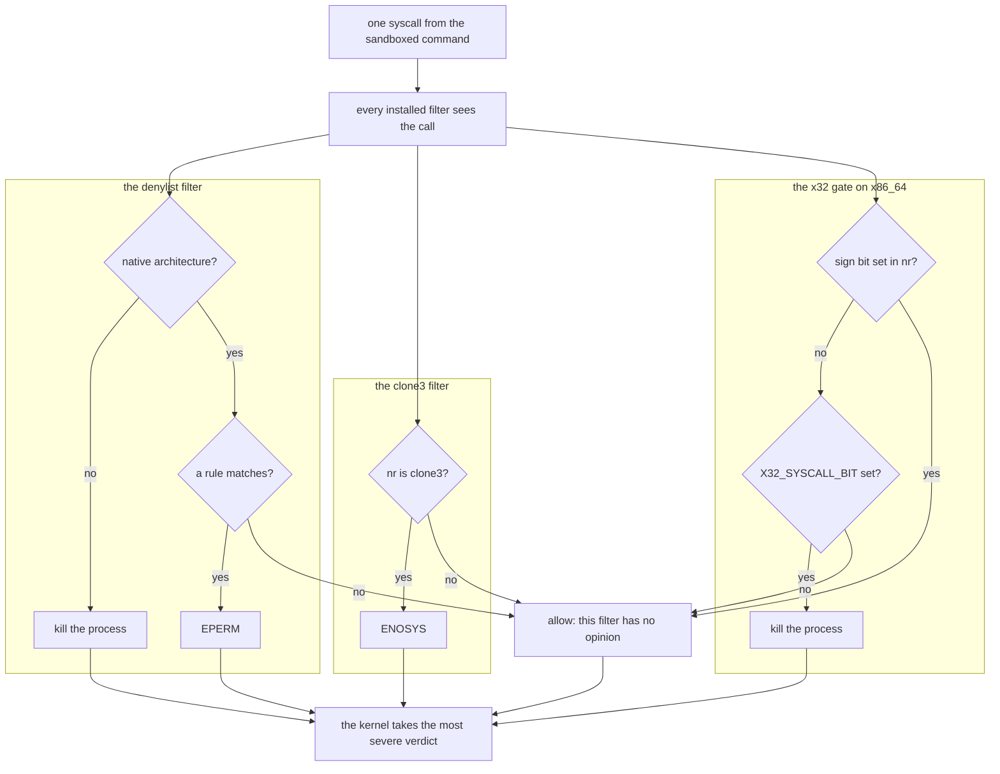
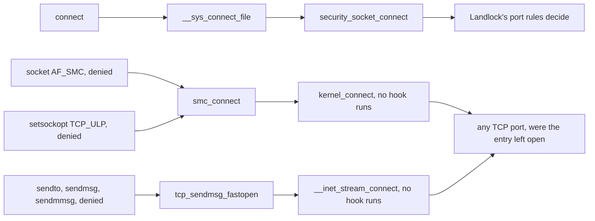

# Seccomp catches the escapes Landlock cannot see

The same box as [09](09-landlock.md), from the other side: the `bash` tool's
`SandboxedCommand`, inside stage 2, where `apply()` installs the boundary — see
[04 — the architecture](04-the-architecture.md) for where that sits. Landlock
polices access *by path*. This chapter is about everything that reaches the
kernel without naming one: another process's memory, a new namespace, a mount, a
kernel module, a datagram.

The two are a pair rather than a redundancy because of a division neither can
cross. Landlock holds paths; seccomp holds syscall numbers and the scalar values
sitting in the six argument *registers* ([07](07-kernel-primer.md) is the
on-ramp). A filter cannot say "nothing under `/etc`", because a filename is
behind a pointer; a ruleset cannot say "no `init_module`", because loading a
module names no path. Every awkward decision below follows from that split.

[guide-sandboxing.md](../guide-sandboxing.md) is the authority and
[`SECURITY.md`](../../SECURITY.md) is the claim. Two files hold the mechanism:
[`seccomp.rs`](../../crates/sandbx-core/src/helper/seccomp.rs) is how a filter
reaches the kernel, and
[`seccomp/rules.rs`](../../crates/sandbx-core/src/helper/seccomp/rules.rs) is
what it denies. Nothing in either touches the kernel until
`deny_dangerous_syscalls` runs.

## Three filters, and which way round they point

`installed_filters` builds three programs on x86_64 and two elsewhere, and
`deny_dangerous_syscalls` installs each in turn. Three rather than one because a
`seccompiler` filter carries a *single* match action, and the three jobs need
three different answers: the denylist answers `EPERM`, `clone3` answers
`ENOSYS`, and the x32 gate kills. Order does not matter — the kernel evaluates
every installed filter and takes the most severe verdict, so a later filter
cannot loosen an earlier one.

All three judge every call; the three answers meet at the bottom, where the
most severe wins:



`EPERM` rather than killing, for the denylist: the syscall does not run either
way, and `EPERM` is what tools already expect on a hardened system, so a program
fails that one operation instead of dying mid-run.

The polarity is the part worth staring at, because it is invisible in the type
system. `SeccompFilter::new` takes the mismatch action *before* the match
action, two arguments of the same type in adjacent positions:

```rust
    let unlisted = SeccompAction::Allow;
    let listed = SeccompAction::Errno(errno as u32);
```

Swap those two and you get a filter that allows the denylist and `EPERM`s
everything else — which would fail so loudly in use that it is tempting to call
untestable. It is not: `deny_with` takes an `errno` rather than a
`SeccompAction`, so no caller can pass `Allow` in the second slot, and
`seccomp/tests/denylist.rs` keeps a deliberate twin of this function with the
two actions swapped. `inverting_the_two_actions_inverts_every_verdict` asserts
that the twin inverts every verdict, which is what proves the other tests in
that file would notice a real swap. The twin only mutates the real path while
`deny_with`'s body does nothing but call `SeccompFilter::new`, and the doc says
so — change the body, change the twin.

## The denylist, grouped by what each group would buy

`BLOCKED_SYSCALLS` is a flat list of 35 numbers, and a denylist rather than an
allowlist on purpose: sandbx runs shells, compilers and package managers, whose
syscall use is unbounded, so the stronger allowlist shape would break real tools
constantly. It is where the filter starts rather than the whole of it:
`blocked_syscalls` seeds from the constant, adds the per-flag `clone` rules —
unconditional too — and then the rules a policy earns, and `installed_filters`
puts two more programs beside the result. What the constant being a flat list
buys is the test: `tests/denylist.rs` compares it against a hand mirror of what
`SECURITY.md` says is denied, in both directions.

Read as groups, by what each one would buy an attacker who got code running
inside the sandbox:

- **Reach into another process.** `ptrace`, `process_vm_readv`,
  `process_vm_writev`, `pidfd_open`, `pidfd_getfd`. The last pair is the one
  people leave out: `pidfd_getfd` takes a descriptor *out* of a process that
  holds one — a connected socket, a file opened above the policy — which is not
  filesystem access, so Landlock cannot express it and denying `ptrace` does not
  cover it.
- **Rearrange the filesystem under Landlock's feet.** `mount`, `umount2`,
  `pivot_root`, `chroot`, and the whole descriptor-based mount API that reaches
  the same thing without calling `mount`: `fsopen` → `fsconfig` → `fsmount` →
  `move_mount` is a complete mount sequence, `fspick` and `open_tree` are the
  handles, and `mount_setattr` clears `MS_RDONLY` on a mount already there — a
  write-enable with no mount at all. A Landlock rule is attached to an inode, so
  the attack here is not opening a new path but changing which object an
  already-ruled *name* reaches. `open_tree_attr` belongs in this group and is a
  deliberate gap: the locked `libc` defines it for no target this builds for.
- **Get a fresh set of namespaces.** `setns` and `unshare` — including out of
  the network namespace just entered. `clone` and `clone3` reach the same
  namespaces and are handled differently; the next two sections are about why.
- **Put code or logic into the kernel.** `init_module`, `finit_module`,
  `delete_module`, `bpf`, `kexec_load`. Anything in this group ends the
  conversation about boundaries entirely.
- **Read credentials, or a side channel.** `add_key`, `request_key`, `keyctl`
  for the kernel keyring, which is where credentials live; `perf_event_open` for
  tracing infrastructure, a known side-channel surface.
- **Act without issuing syscalls, or decide when the kernel's own checks
  resolve.** `io_uring_setup`, `io_uring_enter`, `io_uring_register` run
  operations from a submission queue without the matching syscalls ever being
  issued, so a ring set up in here would route around every rule in this
  filter — including the `AF_UNIX` denials added on top of the list.
  `userfaultfd` is the same shape one level down: it hands the faulting process
  control over *when* a page fault resolves, turning any check-then-use in the
  kernel into an arbitrarily wide window.
- **Stage a payload with no path.** `memfd_create`. An anonymous in-memory file
  has no path and Landlock binds its rules to inodes and paths, so the payload
  would sit outside the filesystem layer entirely. The one entry with a real
  compatibility cost, and a narrow one — the heavy users are container runtimes,
  `systemd` and `snapd`, and a container runtime cannot run in here anyway with
  `unshare` denied. `SECURITY.md` is careful about what this does *not* buy:
  denying `memfd_create` closes one route to a pathless executable, not the
  general ability to exec a descriptor, which is Landlock's job.
- **Reach the whole machine.** `reboot`, `swapon`, `swapoff`. Not escapes —
  none of the three gets code out of the box — but effects on the host that
  outlive the run and that killing the process cannot undo: a restart, or a swap
  device attached or detached under everything else on the machine. Each needs a
  capability the supervisor tries to take away, and each is denied anyway, for
  the reason the `SOCK_RAW` rule below is kept.

## A pointer argument is invisible, which is why `clone3` differs

Everything a seccomp filter can see is in one struct, and
`seccomp/tests/mod.rs` models it as sixteen 32-bit words: the syscall number,
the audit architecture, the instruction pointer, and the six argument
*registers*. Registers — not memory. A classic-BPF program can compare a
register against a constant and mask it; there is no instruction that
dereferences one, and there could not usefully be: the memory behind a pointer
can change after the check and before the kernel reads it, and `userfaultfd`,
denied above, makes that window arbitrarily wide.

That single fact decides the whole shape of this filter. `clone`'s flags are an
`unsigned long` in a register, so they can be compared. `clone3`'s flags are a
field in a `struct clone_args` behind a pointer, so they cannot be — not
narrowly, not at all. A syscall whose security-relevant argument lives behind a
pointer has to go wholesale, which is also why no rule here can look at a path
or a socket address.

So `clone3` goes — but with `ENOSYS`, in a filter of its own:

```rust
fn clone3_filter() -> Result<seccompiler::BpfProgram, SandboxError> {
    deny_with(
        std::collections::BTreeMap::from([(libc::SYS_clone3, Vec::new())]),
        libc::ENOSYS,
    )
}
```

An empty rule vector means "match this syscall unconditionally". The errno is
the interesting part: glibc 2.34 and later call `clone3` from `pthread_create`
and fall back to `clone` **only** on `ENOSYS`. `EPERM` here would break every
threaded program outright instead of routing it onto the filtered `clone`, so
the weaker-sounding answer is the one that keeps the filter enforceable.
`clone3_answers_enosys_so_callers_fall_back` pins both halves: `clone3` answers
`ENOSYS`, and that filter does *not* answer for `clone`, which has to reach the
flag rules in the denylist filter instead.

## The flags `clone` is filtered on, and the two absences

`NAMESPACE_CLONE_FLAGS` names seven: `CLONE_NEWNS`, `CLONE_NEWCGROUP`,
`CLONE_NEWUTS`, `CLONE_NEWIPC`, `CLONE_NEWUSER`, `CLONE_NEWPID`,
`CLONE_NEWNET`. `unshare` is already denied outright, and `clone` reaches every
one of those namespaces through its flags argument, so denying only `unshare`
would leave the escape open (#118).

Two details about *how* they are compared, both of which a reasonable first
attempt gets wrong.

- **One rule per flag, not one rule over the union.** Rules for the same syscall
  are OR'd together, while conditions *inside* one rule are AND'd. So a single
  `MaskedEq` over all seven bits would fire only when every flag was set at
  once. `clone_cannot_reach_a_namespace_unshare_cannot` iterates the constant
  one flag at a time precisely so that a union-only filter cannot pass.
- **`Dword`, never `Qword`.** `arg()` builds every condition at 32-bit width,
  because every argument these rules examine is read by the kernel as a 32-bit
  value — `clone`'s flags through `lower_32_bits`, `socket`'s three `int`s,
  `sendmsg`'s `int flags`. A 64-bit compare would consult register bits no
  kernel check ever sees, so `socket(0xdeadbeef_00000001, …)` — which the kernel
  dispatches as `AF_UNIX` — would walk past a `Qword` rule that named the
  family. That is `the_af_unix_test_ignores_the_domains_high_half`, with
  `the_protocol_rules_ignore_the_arguments_high_half` beside it. Both are
  equality rules, which is where the width bites: `Eq` and `Ne` compile against
  the high half directly. A *masked* rule such as `clone`'s flag test is
  width-insensitive by accident — `seccompiler` emits `high & (mask >> 32)` for
  it, and every mask here fits in 32 bits, so the extra compare is vacuously
  true. `the_clone_flag_comparison_ignores_the_high_half` therefore pins the
  convention rather than a behaviour that would change without it.

The rules must also not cost an ordinary `fork`, which is `clone` with no
namespace flag at all, or a thread, which is `CLONE_VM | CLONE_FS |
CLONE_FILES | CLONE_THREAD`. `clone_without_a_namespace_flag_is_allowed` covers
both, and it is what stops the obvious over-correction: denying `clone`
outright would satisfy every other test in the file.

Two flags are conspicuously *not* in the comparison, and neither absence is an
oversight.

- **`CLONE_NEWTIME` is absent, and not because it is safe.** Its value falls
  inside `CSIGNAL`, the low byte `clone` reads as the child's exit signal, and
  `SYSCALL_DEFINE5(clone)` takes `lower_32_bits(flags) & ~CSIGNAL`. So `clone`
  silently drops the bit and creates no time namespace: the call *succeeds*, and
  no refusal should be read into the absence. `unshare` and `clone3`, which do
  honour the flag, are denied outright — which is where that namespace is
  actually closed.
- **`CSIGNAL` itself is never masked off,** and does not need to be: every flag
  in `NAMESPACE_CLONE_FLAGS` sits above that low byte, so a `MaskedEq` on one of
  them cannot be disturbed by whatever exit signal the caller asked for. The
  test is deliberate about it —
  `clone_cannot_reach_a_namespace_unshare_cannot` ORs `SIGCHLD` into the flags
  word, as a real caller does, so a rule that compared the whole word instead of
  masking would be caught rather than passing on a tidy fixture.

## The x32 gate, instruction by instruction

This is the most intimidating function in the repo and it is six instructions
long. Start with why it exists at all.

A seccomp filter is tied to one architecture's syscall numbers, and
`seccompiler` gates every program on `seccomp_data.arch` before the first
comparison — a mismatch kills the process. That is the right verdict rather than
a harsh one: an i386 binary on x86_64, or AArch32 on aarch64, is using a
*different* numbering, so `nr == 101` does not mean `ptrace` any more and no
per-call answer is meaningful. There is nothing to refuse, because the filter
cannot say what was asked.
`a_syscall_from_another_architecture_is_killed` uses a denylisted number
deliberately, to show the arch gate short-circuits ahead of the chain.

x32 is the awkward case, and the reason for a whole extra filter (#117). It is a
distinct ABI with its own syscall table, but it reports `AUDIT_ARCH_X86_64`, so
it sails straight through the architecture gate. Its numbers are the native ones
with `__X32_SYSCALL_BIT` (`0x4000_0000`) set, which the denylist's native
numbers never match — and four denylisted calls (`ptrace`, `kexec_load`,
`process_vm_readv`, `process_vm_writev`) sit at *different* numbers again in the
x32 table, `ptrace` at 521. So the ABI is refused wholesale rather than
enumerated. Enumerating it would mean maintaining a second table to get the
same answer.

Hand-assembled, because `seccompiler`'s conditions address syscall *arguments*;
`nr` is reachable only as a filter key, one number at a time, and this rule is a
mask over it. `x32_gate` writes the six instructions directly, using the opcode
names `seccomp/tests/mod.rs` composes from `libc`'s field constants:

```rust
    let insn = |code: u16, jt: u8, jf: u8, k: u32| seccompiler::sock_filter { code, jt, jf, k };
    // `jt`/`jf` count from the *following* instruction. Laid out so the two returns sit last:
    // both jumps forward, and the fallthrough is the allow.
    vec![
        // `nr` is the first word of `struct seccomp_data`.
        insn((libc::BPF_LD | libc::BPF_W | libc::BPF_ABS) as u16, 0, 0, 0),
        // Sign bit set? Not x32 — skip to the allow.
        insn(
            (libc::BPF_JMP | libc::BPF_JGE | libc::BPF_K) as u16,
            3,
            0,
            0x8000_0000,
        ),
        // … elided: the mask, the equality test, and the two returns.
    ]
```

The first two of the six, as the file writes them — one blank line elided with
them. An instruction is four positional fields behind that `insn` closure, which
is what the table is for:

| pc | instruction | effect |
|---|---|---|
| 0 | `LD_W_ABS`, `k = 0` | load word 0 of `seccomp_data` — `nr` — into the accumulator |
| 1 | `JGE_K`, `k = 0x8000_0000`, `jt = 3` | sign bit set? jump over the next three, to pc 5 |
| 2 | `ALU_AND_K`, `k = X32_SYSCALL_BIT` | mask the accumulator down to that one bit |
| 3 | `JEQ_K`, `k = X32_SYSCALL_BIT`, `jf = 1` | bit clear? skip one, to pc 5 |
| 4 | `RET_K`, `k = SECCOMP_RET_KILL_PROCESS` | an x32 number: kill the process |
| 5 | `RET_K`, `k = SECCOMP_RET_ALLOW` | everything else: allow, and let the other two filters judge |

Three things make that readable.

- **`jt` and `jf` count from the *following* instruction,** not from the jump
  itself, and they are unsigned, so a classic-BPF jump can only go forward. `jt
  = 3` at pc 1 lands at `1 + 1 + 3 = 5`. The code comment says the layout
  follows from that: put the two returns last, and every jump is forward with
  the fallthrough being the allow.
- **The allow is a fallthrough, and it is not a verdict about the syscall.** A
  filter must return something, and `SECCOMP_RET_ALLOW` here means only "this
  filter has no opinion" — the denylist filter judges native numbers, and the
  kernel takes the most severe verdict across all three.
  `the_x32_gate_lets_native_syscalls_through` pins that this gate leaves native
  calls alone, which matters because a gate that killed everything would still
  pass the test above it.
- **The sign check at pc 1 comes before the mask for a real reason.**
  `syscall(-1)` is legal to pass and every kernel answers `ENOSYS`; as a 32-bit
  word it is `0xffff_ffff`, which has bit 30 set like an x32 number does. A bare
  mask would kill that caller by signal, with nothing on stderr. The kernel's
  own dispatch agrees: `do_syscall_64` special-cases `nr == -1`, and x32
  dispatch is `nr - BIT < X32_NR_syscalls`, so nothing with the sign bit set is
  x32. `the_x32_gate_never_kills_a_negative_number` is the test.

A positive number past the end of the x32 table is killed too, which is
deliberate over-reach: matching the table exactly would mean pinning its size
into this file, and only an x32 caller reaches for those numbers anyway. And the
gate needs no architecture check of its own, since the denylist filter already
kills every non-native architecture.

One coincidence in all this is pinned rather than used. `CLONE_NEWNET` is also
`0x4000_0000`, so the namespace rules and this gate read as though one constant
could serve both — and it cannot, because the two sit in different fields: one
is a flag in `clone`'s first argument, the other a bit in `nr`.
`the_x32_bit_and_clone_newnet_only_share_a_value` asserts the denylist filter
stays indifferent to that bit in a syscall number, so that nobody ever couples a
syscall number to a clone flag by merging the two.

## The tests evaluate the program rather than installing it

Everything named above is asserted on a host with no Landlock, no privileges and
no kernel cooperation, because `seccomp/tests/mod.rs` carries a small
classic-BPF interpreter — `eval` — and runs the compiled program over a
hand-built `seccomp_data`. It is worth understanding before trusting any test in
those modules.

The alternative would be asserting on the program's instruction *layout*, and
the doc explains why that was rejected: the layout is `seccompiler`'s codegen
rather than ABI, and a layout check sees that instructions exist, not that
control flow reaches them — so a wrong jump offset passes. Evaluating relocates
the coupling instead of removing it: the opcode set is closed only as long as
`seccompiler`'s codegen is. What keeps that honest is the panic at the bottom of
`eval`, which fires by name on any opcode it does not implement. The comment
there is blunt that an arm returning a default verdict must never be added — a
mis-evaluation that answered `ALLOW` would be worse than the layout coupling it
replaced.

Two of its own tests are the ones to read.
`eval_implements_the_opcodes_seccompiler_can_emit` runs hand-written programs
through the classic mis-implementations: `JGT` being strict where `JGE` is not,
the comparison being unsigned (an `i32` reading inverts the `-1` case),
`ALU_AND` masking the accumulator *before* the comparison, and `JA` taking its
offset from `k` rather than from `jt`. And
`seccomp_data_puts_each_field_where_the_kernel_does` checks every field by byte
offset, each argument's halves separately, because nothing else in the suite
would notice if the `4 + 2 * i` stride mapped arguments onto each other's
words.

One claim in that file is worth keeping, since it is the one a reader is most
likely to "fix" wrongly: an absolute word load here is *native-endian*, not
big-endian. In socket classic BPF it would be a big-endian packet read, but
`seccomp_check_filter()` rewrites every `BPF_LD | BPF_W | BPF_ABS` into a plain
memory load before the program runs, so it is an ordinary struct field read —
and a `[u32; 16]` is the right model only because every architecture
`seccompiler` supports is little-endian.

## What a TCP port allowlist costs in socket rules

The rest of `blocked_syscalls` is conditional, and the large block is gated on
one thing: `policy.network()` being `NetworkPolicy::Ports`. The claim being
defended is `--allow-network 443` meaning egress reaches that port and nowhere
else, and Landlock's network rules police TCP bind and connect and nothing else.
So anything that carries traffic without passing the hook those port rules hang
off makes the sentence false, and the repo rule is that `SECURITY.md` may not
overstate the sandbox. Either the claim weakens or the transports go.

The gate itself is one match, and the hop worth walking is what it does *not*
carry forward:

```rust
    let confine_to_tcp = match policy.network() {
        crate::NetworkPolicy::Denied | crate::NetworkPolicy::AnyPort => false,
        crate::NetworkPolicy::Ports(_) => true,
    };
```

`Ports` carries a `Vec<u16>` and the match discards it. Not one rule in this
filter names a port, and none can: `connect`'s destination is a `sockaddr`
behind a pointer, so the `443` an operator typed travels past here untouched and
lands in Landlock's port rules instead — [09](09-landlock.md) is where it
arrives. What seccomp compares in its place is register-shaped throughout:
`socket`'s three `int` arguments, `setsockopt`'s level and option number, and
the flags word of the three send syscalls. A reader expecting the port number to
appear somewhere in this file will not find it.

The other two variants get *none* of the five classes below, which makes the
strictest policy carry the fewest socket rules of the three — an inversion worth
having a reason for. `Denied` is already in an empty network namespace, where an
*IP* datagram has nowhere to go, so the rules would add no confinement over IP
while costing `getaddrinfo` the `AF_NETLINK` socket it opens. Over IP is the
limit of that argument: `AF_VSOCK` is not network-namespace scoped, so a
`SOCK_STREAM` vsock to the hypervisor is creatable and dialable under `Denied`
on a VM host, where under `Ports` the family rule refuses it. `SECURITY.md`
scopes its claim to IP egress for this reason, and
[decision-port-allowlist.md](../decision-port-allowlist.md) prices the vsock the
family rule costs an allowlist.
`a_denied_policy_permits_udp_in_an_empty_netns` covers a UDP socket and both
netlink types, `netlink_create` accepting either. `AnyPort` asked for
unrestricted egress, and narrowing it would make *that* flag the lie —
`an_unrestricted_grant_permits_udp`.
[decision-port-allowlist.md](../decision-port-allowlist.md#why-not-for-denied-or-anyport)
weighs both.

Five classes of call falsify it, and each gets rules:

| what reaches a port unpoliced | where the rule sits | rules |
|---|---|---|
| anything that is not a stream socket — UDP, raw, and every other type value | `socket`, on the type field | 15 |
| a stream socket in a family that tunnels IP inside the kernel | `socket`, on the family | 1 |
| a stream socket carrying a protocol that is not TCP | `socket`, on the protocol | 2 |
| a TCP socket converted after it was created | `setsockopt`, on `TCP_ULP` | 1 |
| a connect that happens inside a send | `sendto`, `sendmsg`, `sendmmsg` | 3 |

**UDP and raw sockets are collateral, not targets.** Nothing about them is
dangerous in a way the project set out to stop; they are denied because a
datagram socket would carry traffic to any host on any port while the flag
promised one TCP port, and that falsifies the claim rather than widening the
sandbox. The practical cost lands immediately: `getaddrinfo` can reach neither a
UDP nameserver nor `AF_NETLINK`, which glibc opens as a raw socket, so **name
resolution fails** under a port allowlist. That is the way the flag first
surprises everybody, and `--allow-dns NAME` or `--dns-over-tcp` are the two ways
out. QUIC, HTTP/3 and `ping` go the same way.
[decision-port-allowlist.md](../decision-port-allowlist.md) lists every effect
next to the claim it buys.

Rows two, four and five are one kernel fact in three disguises, and the table
leaves it implicit. `security_socket_connect` — the LSM hook Landlock's port
rules hang off — is reached only from `__sys_connect_file`, the `connect`
syscall's own path. Every other route to a connected socket calls
`sock->ops->connect` directly, and no hook runs at all. `AF_SMC` is the
reachable instance: `smc_connect` (`net/smc/af_smc.c`) dials its inner socket
with `kernel_connect`, and `socket(AF_SMC, SOCK_STREAM, …)` autoloads
`net-pf-43` with nothing privileged, reaching any TCP port. Hence an allowlist
of the two families a port rule can speak about rather than a denylist of the
ones known to tunnel — `AF_TIPC` and `AF_IB` have the same shape. The last two
bullets below are that same hook missed twice more: a conversion after the
socket exists, and a connect hidden inside a send.

The four routes to a connected socket, and the one of them that reaches the
hook. The three that miss it are drawn as the kernel leaves them — which is
why each one's *entry* carries a seccomp rule, the left-hand column being
exactly the rules the table above lists:



Four pieces of shape in that table repay attention:

- **The type field is an allowlist over four bits, not a denylist of two
  constants.** `__sys_socket` reads the type as `type & SOCK_TYPE_MASK` and
  treats the bits above as `SOCK_NONBLOCK`/`SOCK_CLOEXEC`, so an `Eq` against
  `SOCK_DGRAM` matches none of the spellings a modern library actually uses
  while the kernel still hands back a datagram socket — hence `MaskedEq(0xf)`.
  And iterating every value of those four bits except `SOCK_STREAM` is fifteen
  cheap rules and total, where naming `SOCK_DGRAM` and `SOCK_RAW` is a guess
  about what the field can mean. `SOCK_RAW` stays in the loop even though it
  needs a `CAP_NET_RAW` the supervisor drops, on a principle worth adopting:
  this allowlist's integrity must not rest on another subsystem having
  succeeded. Which is not hypothetical here: the capability *bounding* set is
  cleared best-effort, and on a host whose LSM refuses the clear the run
  continues with a `degraded` decision recorded rather than a refusal
  ([06](06-claims-and-non-claims.md)).
- **`SOCK_STREAM` is not TCP, which is why the protocol rules exist.** Landlock
  asks for `CONNECT_TCP` only where `sk_is_tcp` holds —
  `sk_type == SOCK_STREAM && sk_protocol == IPPROTO_TCP` — and returns
  *unrestricted* for anything else, so `socket(AF_INET, SOCK_STREAM,
  IPPROTO_MPTCP)` was a stream socket no port rule ever saw. Those two rules
  name `AF_INET` and `AF_INET6` rather than excluding `AF_UNIX`, because beyond
  those two families a protocol number means something else entirely; protocol
  0 passes beside `IPPROTO_TCP`, meaning "this family's default", which for a
  stream socket is TCP.
- **A socket's family does not stay fixed at `socket` time.**
  `setsockopt(fd, SOL_TCP, TCP_ULP, "smc")` on exactly the shape the allowlist
  permits runs `smc_ulp_init`, which reassigns the file's private data so a
  later `connect` dispatches to `smc_connect`. The hook still runs — it is an
  ordinary `connect(2)` — but `sk_is_tcp` is false for the `PF_SMC` sock, so
  Landlock returns 0, meaning unrestricted: any TCP port. Nothing privileged is
  involved. So the denial is a second rule on a second syscall rather than a
  wider version of the family rule, and it names the *option* and not the ULP,
  `optval` being behind a pointer. That costs in-process kTLS, and it is
  fail-closed: a ULP added to the kernel tomorrow is denied with no edit.
- **TCP Fast Open connects inside a send, which is why three send syscalls are
  in the table at all.** `tcp_sendmsg_locked` routes a send carrying
  `MSG_FASTOPEN` into `tcp_sendmsg_fastopen`, which calls
  `__inet_stream_connect` directly, so the port in `msg_name` is one Landlock
  never sees — and `net.ipv4.tcp_fastopen` has client mode on by default, so
  nothing has to be enabled first. For once the escape is register-shaped: the
  flag is an `int`, so the rule names the flag rather than the syscall, and the
  loop carries the flags argument's index beside each number — 3 for `sendto`
  and `sendmmsg`, 2 for `sendmsg`, where a single index would silently compare
  the wrong register. Both halves are pinned, by
  `a_port_list_denies_tcp_fast_open_sends` and
  `a_port_list_permits_an_ordinary_send` — the second because an allowlisted
  port nothing may write to is no grant at all.

Unix sockets are a separate axis, not a sub-case of this one, and the code is
careful to keep them apart in both directions. The denial applies whenever the
policy does not grant unix sockets, regardless of network policy, because a
netns isolates only *abstract* unix sockets while pathname sockets live in the
filesystem and cross a namespace freely — a command that can dial the session
bus, a docker socket or an ssh-agent has them act outside the sandbox. That is
an escape rather than egress, so granting the internet does not grant it. In the
other direction, every type rule above carries an explicit `domain != AF_UNIX`
condition, so a denial aimed at IP egress does not silently narrow a grant it
never mentions.

**There are two routes to an `AF_UNIX` descriptor, and the second one does not
call `socket`.** `socket(AF_UNIX)` is the one the rule above names;
`socketpair(AF_UNIX, …)` is the other, and it hands back a descriptor the first
rule never sees. What makes that matter is not the descriptor but whether it can
be re-aimed: a *connectionless* pair can be, `connect` on a `SOCK_DGRAM` half
taking a `sockaddr_un` and delivering to a host pathname socket no grant named.
So a second rule denies `socketpair` for every type except `SOCK_STREAM` and
`SOCK_SEQPACKET`.

Three details of that rule are worth the stare, and each is a shape this chapter
has already met:

- **An allowlist, not a `SOCK_DGRAM` denylist** — the same choice the `Ports`
  type loop above makes, for the same reason. A connectionless type a future
  kernel gives `AF_UNIX` arrives denied rather than permitted.
- **`MaskedEq` against `SOCK_TYPE_MASK`**, because `__sys_socketpair` masks
  `type` exactly as `__sys_socket` does, so a plain `Eq` would be walked past by
  the `SOCK_CLOEXEC` a caller sets anyway. One constant now documents both
  call sites.
- **What makes permitting the two connection-oriented types safe is a kernel
  *state*, not a type.** `unix_stream_connect` refuses any socket not in
  `TCP_CLOSE`, and a pair is born `TCP_ESTABLISHED`, so `connect` on either half
  answers `EISCONN`. That is a claim about the kernel and so it was measured
  rather than reasoned from — with the peer open, with it closed, after
  `shutdown(SHUT_RDWR)` and after both — and
  [guide-sandboxing.md](../guide-sandboxing.md) keeps the measurement as the
  paragraph to re-measure against. The compatibility cost is the datagram pair
  alone; the connected pair shells and build tools use as a pipe still works,
  which is what the earlier, laxer comment had been protecting.

The flag stays all-or-nothing, and the reason has two halves now rather than
one. seccomp cannot follow the pointer to `connect`'s path, so only the
filesystem policy could narrow *which* socket is dialled — and the mechanism for
that is Landlock's `ResolveUnix`, which exists at ABI V9 (Linux 7.1) and which
this same flag confers on the paths it granted ([09](09-landlock.md)). At or
below V8, which is every kernel shipping today, this denial is the whole of the
control: a hardcoded `/run/docker.sock` is dialable holding no grant that names
it. `SECURITY.md` states it that way rather than as what the filesystem policy
*would* bound.

One structural guard holds the two producers apart. `socket` can receive rules
from the unix-socket branch and from the port-allowlist branch, and `deny_when`
appends rather than inserting — because rules for one syscall are OR'd, so an
`insert` would let the second producer wipe the first with no trace. It also
skips entirely when an *unconditional* denial for that syscall already exists,
since an empty rule vector means "match every call" and appending to one would
turn a total denial into a partial one. That is the filter getting weaker
because a number was added to `BLOCKED_SYSCALLS`, and
`a_conditional_rule_cannot_weaken_an_unconditional_denial` is the test.

- **Worth questioning:** the one flag in the system that both narrows and widens
  the boundary says only the narrowing out loud.
  [decision-port-allowlist.md](../decision-port-allowlist.md#the-host-network-namespace-is-shared-not-narrowed)
  is admirably plain that `allows_network()` is true for `Ports`, so
  `hardening::isolate` drops `CLONE_NEWNET` and the command lands in the
  *host's* network namespace — host loopback reachable on an allowlisted port,
  and the host's abstract unix socket namespace no longer isolated, leaving only
  the two `AF_UNIX` denials in front of it. The record's conclusion,
  "narrower on remote ports, wider on what is local", is right, and
  `SECURITY.md` repeats it. What neither weighs is that the *flag* carries none
  of this: `--allow-network 443` reads as a narrower `--allow-network`, and the
  widening arrives as a side effect of asking for less.
  [decision-default-policy.md](../decision-default-policy.md) settles a very
  similar question with "narrow and loud beats wide and silent", and the same
  standard would ask for either a second flag the operator has to type, or a
  refusal where a port list is the only thing keeping a run out of the host's
  namespaces. The step that is missing is not the mechanism — the netns drop is
  forced, as the record says — but the loudness.

## You should now be able to explain

- Why there are three filters rather than one, and why the order they are
  installed in does not matter.
- Why `clone` can be filtered on its flags while `clone3` has to be refused
  outright, in terms of what a seccomp program can and cannot read.
- Why `clone3` answers `ENOSYS` rather than `EPERM`, and what breaks if it does
  not.
- Why the namespace flags get one rule each, and why the comparison is 32-bit.
- Why `CLONE_NEWTIME`'s absence from the flag list is not a hole.
- What each of the six instructions in the x32 gate does, and why x32 needs a
  rule at all when it reports the architecture the filter already gates on.
- Why a foreign architecture is killed rather than refused per call.
- Why the tests interpret the compiled program instead of asserting on its
  instruction layout, and what the interpreter's panic arm is for.
- What has to be denied for "egress reaches this port and nowhere else" to be
  true, and why name resolution is the first casualty.
- Why the port numbers in `--allow-network 443` appear nowhere in this filter,
  and what it compares instead.
- Why `Denied`, the strictest network policy, carries fewer socket rules than a
  port allowlist.
- How a family that tunnels IP, a `TCP_ULP` conversion and a TCP Fast Open send
  all reach a port without `security_socket_connect` running.
- Why `AF_UNIX` is governed by a different grant from the network policy, which
  two syscalls reach one, and why a connected `socketpair` is left permitted.

## Next

[11 — the two seams](11-the-two-seams.md), which is the correction to the
easiest wrong conclusion to draw from this chapter and the last: the filter and
the ruleset apply to one of the seven tools. The authorities this pair is an
on-ramp to are [guide-sandboxing.md](../guide-sandboxing.md) for the subsystem
as a whole, and [decision-port-allowlist.md](../decision-port-allowlist.md)
beside [decision-egress-proxy.md](../decision-egress-proxy.md) for the two
records that price what this filter can and cannot be asked to do.
