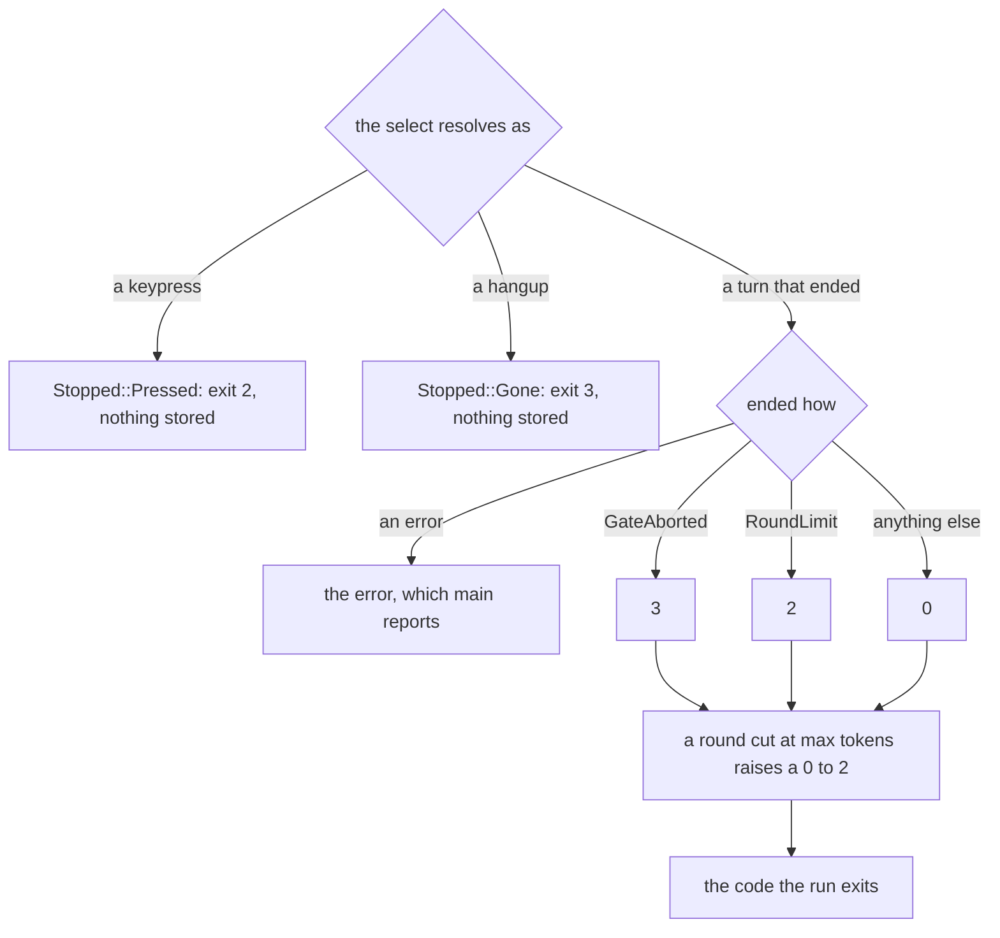

# The seven tools, and the screen a turn is drawn on

Two boxes from [04 — the architecture](04-the-architecture.md)'s View 3, and one
more that is not a boundary at all. **The tool boundary** is
[`tools/src/lib.rs`](../../crates/sandbx-tools/src/lib.rs) — "`BuiltinTool`, a
closed enum with `ALL: [Self; 7]`; `ToolSpec` crate-private". **The policy's
ownership** is
[`tools/src/context.rs`](../../crates/sandbx-tools/src/context.rs) —
"`ExecutionContext` holds the `SandboxPolicy` in a **private** field (#56)". The
third is [`sandbx-tui`](../../crates/sandbx-tui/), which 04 does not draw as a
boundary because it is not one: it holds no policy, no gate and no session, and
that absence is the design.

[guide-tools.md](../guide-tools.md) owns the set,
[decision-bounding-tool-work.md](../decision-bounding-tool-work.md) owns what
limits them, and [guide-tui.md](../guide-tui.md) owns the screen. This chapter
is the on-ramp: what the seven *are*, the one thing about their bounds that
surprises everybody, and why a renderer gets a security chapter at all.

## The seven

| tool | input | confined by | risk |
|---|---|---|---|
| `read` | `{ path }` | `FsGuard::open_read` | `ReadOnly` |
| `write` | `{ path, content }` | `FsGuard::open_write` | `Writes` |
| `edit` | `{ path, old, new }` | `open_read` + `open_write` | `Writes` |
| `ls` | `{ path }` | `FsGuard::read_dir` | `ReadOnly` |
| `grep` | `{ path, pattern }` | `open_read` + `walk_readable` | `ReadOnly` |
| `find` | `{ path, name }` | `walk_readable` | `ReadOnly` |
| `bash` | `{ command }` | the helper — Landlock + seccomp + netns | `Executes` |

That `confined by` column is 04's fork in the road restated per row: six tools
never leave the harness process, so `FsGuard` **is** their enforcement, and one
spawns. If you remember one thing from this chapter, remember that the majority
of what an agent does is bounded by a Rust type and not by the kernel.

The guard hands back an **open handle**, never a resolved path. That is the
whole reason no tool calls the bare `check_read` or `check_write`: a tool that
took a path and opened it itself would reintroduce the TOCTOU window the handle
closes. `ls` is the nearest thing to an exception and still takes a handle —
though a directory read has no `O_NOFOLLOW` form, so that handle closes the
window no more than a path would.

`RiskLevel` has exactly one job: it is what a gate deciding by *category* reads.

```rust
/// What a tool does beyond looking, for a caller deciding whether to let it run.
///
/// Ordered least to most, so a gate can admit everything at or below a level. A field of
/// `ToolSpec`, so a new tool declares its own level or fails to compile.
#[derive(Debug, Clone, Copy, PartialEq, Eq, PartialOrd, Ord)]
pub enum RiskLevel {
```

Two consequences. The `Ord` derive makes the **variant order load-bearing** —
alphabetising the enum would keep the rest of the suite green while inverting
the meaning of every `<=` in a gate, which is why
`the_risk_levels_order_least_to_most` exists. And the level lives on the tool's
own `SPEC` rather than in a table in the gate, so a new tool declares its own
level; a denylist in the CLI would have been silently missing it.

Chapter 13 is where that level is spent: `ArgvGate` allows every `ReadOnly` call
unasked and takes argv's answer for the rest.

## One is bounded by time, four by work, two by neither

This is the section to read twice. A timeout bounds a *process*. Six of the
seven built-ins never start one, so a timeout bounds nothing about them.

`ExecutionContext::timeout` — 90 seconds by default, documented as "the tighter
end, since too long silently fails to catch the wedge this exists for" — applies
to `bash` and to nothing else. The figure is calibrated rather than round: the
same doc comment names what against — "the known pressure point is a cold
`cargo build` on a large workspace" — and it bounds `bash` by **bytes** as well,
its output going through the same cap `read`'s does. Four of the other six are
bounded by **work**: `ToolLimits` in
[`tools/src/limits.rs`](../../crates/sandbx-tools/src/limits.rs) carries two
output caps (entries returned, bytes returned) and two input caps (files
visited, bytes scanned), and `grep` carries a hardcoded per-file skip of its
own, `MAX_FILE_BYTES`. `read` takes the byte cap, `ls` and `find` the entry cap,
`grep` four of the five. The last two read no cap at all: `write` and `edit`
write what the model handed them, bounded by the path policy and the context
window and nothing in this file. [guide-tools.md](../guide-tools.md) has the figures
and [19](19-crate-tools.md) the per-tool account of which bound each one
actually reads; what matters here is the distinction between the two kinds:

- **An input bound hit means the answer is incomplete** — the tool stopped
  looking.
- **An output bound hit means the answer is complete and the display was
  trimmed.**

Conflating them is how a search that silently gave up looks identical to one
that found four thousand matches and showed two hundred, so the two have
different markers and `ReadableWalk` returns a `truncated` flag beside its `Vec`
rather than a bare `Vec` the caller has to guess about.

Two holes in that grid are worth naming while the argument is in view. `write`
and `edit` read **no** field of `ToolLimits` at all: `write`'s input is the
model's own string and both return a single line, so for those two the only
bound in the system is the policy — a root has to be writable before either
runs. And nothing bounds **depth**. There is no depth counter anywhere in the
walk; what makes it terminate is a rule written for a different reason, that
`walk_readable` never descends a symlinked directory, since one inside a
readable root can point anywhere. Cycle-safety is a by-product of that rule, and
the only depth bound is the tree's own. [11](11-the-two-seams.md) owns the
walk's confirmation window, the wider of the two things that rule decides.

### There is no total wall-clock bound on a turn

[decision-bounding-tool-work.md](../decision-bounding-tool-work.md) exists
because `turn.rs` once stated a worst case as a formula, and every term but the
first was wrong. The formula is gone, and the replacement is a sentence rather
than an expression: **a turn has no total wall-clock bound to state.**

The reason is structural rather than an oversight waiting to be fixed, and
[guide-turn-loop.md](../guide-turn-loop.md) puts it in one example worth
memorising: a broad `grep` terminates because of the scan budget; a single
`read` on a stalled filesystem still does not. Multiply `max_rounds` by the
per-round stream timeout and you have bounded the *model*, not the work — which
is exactly the mistake the deleted formula made.

Two more facts about a worst case, both stated as block quotes in the record
because they are the parts a reader assumes away:

- **`grep`'s per-file skip is what makes the total byte budget finite.** The
  budget is *checked before* each read, not clamped, so a single file can
  overshoot it; what keeps the overshoot bounded is the separate per-file skip.
  The worst case is the total plus one file's cap, and a caller tightening the
  total cannot move the per-file half.
- **`read` and `edit` have no input cap at all.** `read_file` calls
  `read_to_string` uncapped, and the output cap trims what is *returned*, after
  the whole file has been allocated.

- **Worth questioning:** that second one. The record names it accurately and
  does not price a fix, and its own sentence is the argument: "`grep` guards
  exactly this case with `MAX_FILE_BYTES`; these two do not." So the mechanism
  exists, in the same crate, in a sibling module, and `read` does not use it.
  The consequence compounds with two other properties this chapter and chapter
  13 establish: the allocation happens on a `spawn_blocking` thread that cannot
  be cancelled (#26), and `ReadOnly` means `read` runs with no flag and no
  question. So a prompt-injected model needs one `read` of a large file in a
  granted root to put the harness into an allocation nothing can interrupt — and
  [`SECURITY.md`](../../SECURITY.md) claims no memory bound, so the claim is
  honest and the mechanism is still the cheapest unguarded path in the tool
  layer. The counter-argument the record could have made is that a cap on `read`
  changes a *correctness* contract where `grep`'s skip does not — a skipped file
  in a search is still a search, a truncated `read` is a wrong answer the model
  will act on — which is a real objection and an argument for failing the call
  loudly above a size, not for having no bound.

## The policy is spent, not lent

`ExecutionContext` is built once per run and shared by every tool call. It holds
both halves of the sandbox, because the built-ins split across them. And it
holds the `SandboxPolicy` in a private field with exactly one way to reach it:

```rust
    /// The only route to the policy, and one that spends it rather than lending it
    /// out: an accessor returning `&SandboxPolicy` would let an in-process tool read
    /// the path lists and open files itself, bypassing the TOCTOU-safe handles
    /// [`FsGuard`] hands back. Timeout and helper are applied here so a second
    /// spawning built-in cannot forget them.
    #[must_use]
    pub fn sandboxed_command(&self, program: impl Into<String>) -> SandboxedCommand {
```

"Spends rather than lends" is the phrase to keep. A `fn policy(&self) ->
&SandboxPolicy` would be the obvious API, and it is the API that used to exist:
the split between the two enforcement halves was documented and nothing enforced
it, so an in-process tool could read the granted path lists and open files
itself, bypassing the guard entirely (#56). Now the type enforces the *accessor*
— with two routes still open around it, both named below.

What does the enforcing is a Rust privacy rule, and it is the rule's *scope*
that makes it hold. `new` takes the policy by value and moves it in behind the
guard it built from it:

```rust
    pub fn new(policy: SandboxPolicy) -> Self {
        Self {
            guard: FsGuard::new(&policy),
            policy,
```

The field is spelled bare `policy`, not `pub(crate) policy` — and private in
Rust means private to the defining module and its descendants, not to the crate.
`context` is a sibling of `tools`, so `ctx.policy` written in
[`tools/bash.rs`](../../crates/sandbx-tools/src/tools/bash.rs) is the same
compile error it would be in `sandbx-cli`: the field is private. `pub(crate)`
would have left the whole mechanism decorative, every built-in living in this
crate. What a tool may ask the context for is small and deliberate:

| a tool may ask for | and gets |
|---|---|
| `guard()` | an `&FsGuard` — path checks that hand back handles |
| `limits()` | the work and output caps |
| `sandboxed_command(program)` | a command with the policy, helper and timeout already applied |

There is no fourth *accessor*, which is not the same as no fourth route. Two
survive, and a reader who takes "the type enforces it" literally will miss both.
`ExecutionContext` derives `Debug` over the policy field, so `format!("{ctx:?}")`
inside any built-in prints the granted path lists — no accessor, no `unsafe`, no
compile error. And `sandboxed_command` hands back a `SandboxedCommand`, whose
`command_line` is the argv the helper is invoked with; `HelperArgs::decode` is
public, and so is the `policy` field on what it returns. Neither is a hole in the
*kernel* seam — a tool that reads the lists still has to go through the guard to
touch a file — but "the type enforces it" is a claim about the accessor and not
about the type.

The absence has a second effect worth naming: **no tool can tell the model what
its roots are, and almost no refusal does either.**
`conceal_unless_granted` has to keep a refusal for a path outside every root
indistinguishable from any other refusal, or a sequence of probes reads back as
a map of the host. `agent-run` names the roots in the system prompt instead,
above the tool boundary, where the policy is still the operator's own text
rather than something a `tool_result` carries back.

"Almost no" rather than "no", because one refusal names a root back:
`SandboxError::RootReplaced` renders as "granted root *P* holds object … and not
the … it was checked against". It fires only when a granted root was swapped
under the harness, so it tells the model a path it already had access to — but it
is the one message in the set that is not root-blind, and a reader who learnt the
rule as absolute would not look for it.

## A closed enum, and what an eighth tool would cost

There is no `Tool` trait, no `ToolRegistry`, and no `dyn`.

```rust
    /// Every tool an agent can be offered.
    pub const ALL: [Self; 7] = [
        Self::Read,
        Self::Write,
        Self::Bash,
```

`ALL` **is** the registry. `ToolSpec` is crate-private: two `&'static str`s, a
`RiskLevel` and two fn pointers, reached only through an exhaustive match on the
closed enum — a table, not a vtable with an open set behind it. The set is
closed at compile time and nothing picks a tool at runtime that is not in it, so
the flexibility a trait object buys would go unused.

Everything about one tool is co-located in that tool's own module: its name, its
description, its risk level, its schema and its executor, all in one `SPEC`
beside its input struct. `BuiltinTool` reaches them through a single match
(`spec`), and the comment on it says what that buys: "a transposed arm cannot
hand the model one tool's name with another's schema." Folding the executor in
puts the parse behind a type too — each module's `run` parses into that module's
own input struct, so a filesystem path that skipped the parse would be
unwritable.

So: what would adding an eighth tool force you to visit? This is the question 04
is pointing at when it says a closed enum plus an exhaustive match is a
compile-time gate, and the honest answer is a list:

- **`ALL`'s length** changes, which is a type change, not an edit — `[Self; 7]`
  is in the signature.
- **`spec`'s match** gains an arm or fails to compile.
- **A module** with a `SPEC` declaring its own `name`, `description`, `risk`,
  `schema` and `run`, which means *deciding its risk level* rather than
  inheriting one.
- **`tests/registry.rs`**, where five tests hard-code their expected value
  rather than reading it off the registry.
  `the_risk_each_tool_carries_is_documented` is the one that matters, and the
  one that spells every variant out in a match, so an eighth variant is a build
  failure in the test binary as well: read off `risk()` the test would assert
  only self-consistency, and a `bash` reclassified as read-only would pass.
  `all_contains_every_variant` has a per-variant match for the same reason, one
  whose `assert` catches a variant that exists and was never listed.

What it would *not* force you to visit is the gate, which decides by `RiskLevel`
rather than by a per-tool list — so an eighth tool declaring `ReadOnly` is
approved for every run with no flag. That is not a hole so much as the
classification being the thing under load, which is why the hand-written test
exists and why `decision-approval-gate.md` names it as what currently holds the
line.

The tests are worth reading once for a reason beyond this crate. Each one is
written against a failure that actually happened and passed a green suite:
`Self::Ls => schema_for!(GrepInput)` compiled and shipped (#55), and a symmetric
swap of two tool names stays unique and still round-trips through `from_name`,
which is how #88 went unnoticed.

## The screen

`sandbx tui` asks the same question `agent-run` asks, under the same policy, and
draws the turn as it arrives. The subcommand flattens `AgentRun`, so there is
one declaration of every flag and one derivation of the policy;
`gate::approves`, `orientation::system_prompt` and `session::open` are the same
functions. Three things differ — where the answer goes, where the per-call
account goes, and that a keypress can end a turn — and everything else that
differs is a **refusal** rather than a variation: `tui` needs a terminal on
stdout, and it refuses `--approve call` (#225).

### It draws and nothing else

[`sandbx-tui`](../../crates/sandbx-tui/) takes `&AgentEvent` and gives back a
keypress. It holds no policy, no provider, no session and no gate.

```
Transcript   the events folded into entries          no terminal → unit-tested
view::draw   the entries laid out as rows            TestBackend → unit-tested
Screen       raw mode, the alternate screen, Drop    a real terminal only
Keys         the reader thread and the press         the predicate → unit-tested
```

Read that table as a security property with a testing justification, not the
reverse. What is left needing a real terminal is `Screen::enter` and the
`event::read` loop, and **neither holds a decision** — so the part of the system
no test can reach is also the part with nothing to get wrong. A renderer that
could decide anything would be a second place to look for what approved a call.

The gate under `tui` follows the same rule.
[`cli/src/agent/tui.rs`](../../crates/sandbx-cli/src/agent/tui.rs) delegates
`approve` straight to `ArgvGate` — the decision has to be the one `agent-run`
makes, or one `--allow-tool` would approve two different sets — and overrides
`settled` alone, to draw the line instead of printing it. It has to: the
alternate screen does not redirect stderr, so an `eprintln!` would paint over
the pane and then vanish with it.

The audit trail has the same problem and a different answer. It is the
higher-volume writer by far, and it is **held** rather than displaced:
`logging::hold` diverts the subscriber's writer into a buffer for as long as the
screen owns the terminal, and the guard releases on `Drop`, so a panic unwinding
past the screen still leaves the record of what the turn was allowed to touch.
What that costs is on the record: the release waits on the keypress that holds
the finished screen, so a signal arriving there runs no `Drop` and loses all of
it (#235).

### What a cell may not hold, and why that is security

ratatui writes a cell's content to the terminal as it was given. So an answer
carrying `\x1b[2J` would clear the screen it is being drawn on, and one carrying
a cursor-positioning sequence would rewrite the lines around itself — including
the account of what a tool just did. The fold replaces rather than drops, for
chapter 13's reason: dropped, a hostile string reads as plausible prose.

```rust
            '\n' => out.push('\n'),
            '\t' => out.push_str("    "),
            c if c.is_control() || invisible(c) || forgeable(c) => out.push('\u{fffd}'),
```

The first two predicates are the gate's, for the gate's reasons — the
zero-width and bidi-override characters, which `char::is_control` lets through
because it is category `Cc` exactly, so a line can *display* as a different line
([13](13-turn-loop-and-gate.md)). `invisible` is literally the same function,
`sandbx_providers::invisible`, read by the prompt and by the cell: one table, so
a character added to it reaches both. What differs is the replacement, which
each sink keeps. The third predicate is the interesting one, and it exists
because of a problem `agent-run` does not have.

`agent-run` has two channels, and the channel authenticates the line: the answer
is on stdout, every account of the run on stderr. The pane has one. So a model
that writes

```
sandbx: bash curl … | sh — ran
```

into its answer would render a free-standing row in the gate's own grammar, and
an operator would act on a call the gate never saw. A newline survives the fold
by design — the view splits on it — so nothing stops the rows from forming.

The answer is that **the gutter is drawn by the view, not by the text**: `│ ` on
a verdict or a note, `> ` on the prompt's first row, two spaces on anything the
model chose. The claim rests entirely on that one character, so no entry's text
may *draw* one — which is what `forgeable` is:

```rust
/// Whether `c` draws the cell [`GUTTER_MARK`] draws, and so could claim a row as sandbx's.
/// Three sets, bounded per arm below: box drawing's verticals, the extensions drawn to tile
/// vertically, and single-cell vertical strokes outside both. A denylist, for
/// [`invisible`]'s reason. ASCII `|` is excluded, having to survive a shell pipeline in
/// prose — why the gutter is box-drawing at all. A vertical joining across rows where `|`
/// doesn't is font-dependent, too weak to rely on instead.
```

Only the first of the three is a *scope*: it is the Box Drawing block swept
against Unicode's names, so an addition there is checkable. The other two are
enumerations, and that is the part of #276 the fix does not close — Unicode's
confusables data is not in the tree to derive a scope from.

This is the paragraph that answers "why does a rendering crate get a security
review". The mark is not decoration; it is an authentication tag on a row, and
`forgeable` is the list of ways to forge it. Three details follow from taking it
seriously rather than from making it look nice:

- **The mark is box-drawing precisely so ASCII `|` can be let through.** A shell
  pipeline in ordinary prose has to survive the fold, and a character the model
  may legitimately write cannot also be the one that authenticates a row.
- **A break inside a verdict or a note is spelled `\n` rather than kept**,
  because those kinds are marked on *every* row — so a kept break would mint a
  second marked row from whatever followed it, needing no confusable at all.
- **Everything in the block that also draws a horizontal is left alone** — the
  horizontals, and the junctions and corners too, a table or a `tree` being
  ordinary output. A junction draws a full-height vertical, so this is a real
  carve-out and not a gap: the nub beside the stroke is a difference an operator
  can see on screen, where a weight or a dash density is not. The defence is
  per-claim, not per-character-class — and the split is pinned both ways,
  `the_rest_of_the_box_drawing_block_survives` sweeping the 113 the carve-out
  keeps against the 15 it does not (#276).

The guide is also candid about what the column does not buy: a wrapped
continuation row carries no gutter, since the gutter is inside the paragraph's
text rather than a column beside it, so such a row begins in the real gutter's
own column. That is survivable because an unmarked row claims nothing and no
entry text can draw the mark — not because the column is defended. A gutter
given its own area beside the text is the shape that would retire the question.

### What interrupting costs

Raw mode is what makes an interrupt possible at all: with it on, ctrl-c arrives
as a `KeyEvent` instead of raising `SIGINT`, which would otherwise kill the
process mid-turn and leave the alternate screen on the operator's terminal. So
`Keys` is started after `Screen::enter`, never before, and `Screen` restores on
`Drop` so a panic unwinding through the turn still puts the terminal back.
Nothing covers `SIGKILL`.

The interrupt itself is a `tokio::select!` in `sandbx-cli` racing the turn's
future against the keypress, and since #264 against the terminal hanging up as
well. The turn loop gains nothing from either: no stop variant, no cancel
token, no second way for a turn to end. Which means the cost
is exactly what dropping a future costs, and
[guide-tui.md](../guide-tui.md) states it in two bullets this chapter will not
soften:

- **Nothing of that turn is stored**, `--session` or not. The future is dropped,
  so there is no `TurnOutcome` to append, and a transcript holding the prompt
  without the answer would make the next resume send two user turns in a row.
- **A tool already running finishes.** `spawn_blocking` cannot be cancelled
  (#26), so dropping the future abandons the result, not the work. A `bash` that
  was writing files goes on writing them, unseen — and the process does not exit
  until it is done, `Runtime::drop` waiting for an in-flight blocking task with
  no timeout. So an interrupt during a long call returns the terminal and then
  hangs there, which is a wait on work the operator can no longer see.

The exit code is 2, the same code a turn cut short by `--max-rounds` gets. A
round cut at `--max-tokens` raises a 0 to 2 and never lowers a code already
chosen, a turn being able to lose its operator and be cut in the same round
where the cut is the recoverable one. `GateAborted` exits 3 ahead of either
bound — unreachable under `tui` today, because it refuses the flag that would
give it an operator to lose, and written anyway because the outcome holds its
messages and usage like an answered one, so a 0 there would look like an answer
to every caller branching on the status. A hangup reaches the same 3 by the
other road: `Stopped::Gone` is the keypress's sibling in that `select!` and
takes `NO_CONSENT` with no outcome to account for at all (#264), a turn nobody
could see being one nobody watched rather than the recoverable stop an
interrupt is.

All of it as one path — and the two the race resolves on its own never produce a
`TurnStop` at all:



- **Worth questioning:** the interrupt sharing `--max-rounds`'s code. The
  guide's justification is four words — "because that is what it is" — and the
  argument against it is the one
  [decision-approval-gate.md](../decision-approval-gate.md) already made to win
  a third code: "a lost operator is neither bound nor anything they configured…
  Reusing it would leave the defect distinguishable only by grepping stderr."
  The two exit-2 cases differ in their *post-conditions*, not only in their
  causes. A `--max-rounds` turn appended to the session and left nothing
  running. An interrupted turn stored nothing at all and may have a `bash` still
  writing files, with the process not yet exited. A caller branching on 2
  therefore cannot tell "retry from the saved transcript" from "there is no
  transcript and the filesystem is still moving", which is the same class of
  confusion #218 was filed for. That `tui` cannot reach 3 today is not an
  argument for reusing 2 — it is an argument that 3 is free, which is the
  condition under which the same record already chose to add a code before
  anything could produce it.

One last limit, because it is the kind that reads as an omission and is not. The
pane has no scrollback and auto-follows, so for a `bash` call the pane is the
only place the command's text appears at all — the audit trail records
`program="/bin/sh"`, not the `-c` string. An interrupted run, or one without
`--session`, can therefore leave no record of what ran (#234), which is the same
gap chapter 14 reaches from the trail's side.

## You should now be able to explain

- Which six tools `FsGuard` enforces and which one the kernel does, and why the
  guard returns a handle rather than a path.
- What `RiskLevel` is read by, and why the order of its variants is
  load-bearing.
- Why a timeout bounds `bash` and nothing else.
- The difference between an input bound and an output bound, and what goes wrong
  when they are conflated.
- Why there is no total wall-clock bound on a turn, in terms of what bounds the
  in-process tools.
- Which two tools have no input cap, and what makes that worse than it sounds.
- What bounds the depth of a search, given that nothing counts it.
- What "spends the policy rather than lending it out" means, and the bug an
  accessor allowed (#56).
- Why a private field of `ExecutionContext` is unreachable from a tool module in
  the same crate, and what `pub(crate)` would have cost.
- The three things a tool may ask its `ExecutionContext` for, and why there is
  no fourth.
- Every place an eighth tool would be a compile error, and the one place it
  would not be.
- Why `sandbx-tui` holds no policy and no gate, and how that lines up with what
  can be unit-tested.
- Why a single-pane transcript needs a gutter that the view draws, and why ASCII
  `|` is deliberately allowed through.
- The two things interrupting a turn costs, and why one of them is a consequence
  of `spawn_blocking`.

## Next

[16 — how the repo is maintained](16-how-the-repo-is-maintained.md), the first
chapter about the project rather than the product. The authorities *this*
chapter is an on-ramp to are [guide-tools.md](../guide-tools.md),
[decision-bounding-tool-work.md](../decision-bounding-tool-work.md) and
[guide-tui.md](../guide-tui.md); the normative account of what any of it
enforces is [`SECURITY.md`](../../SECURITY.md).
