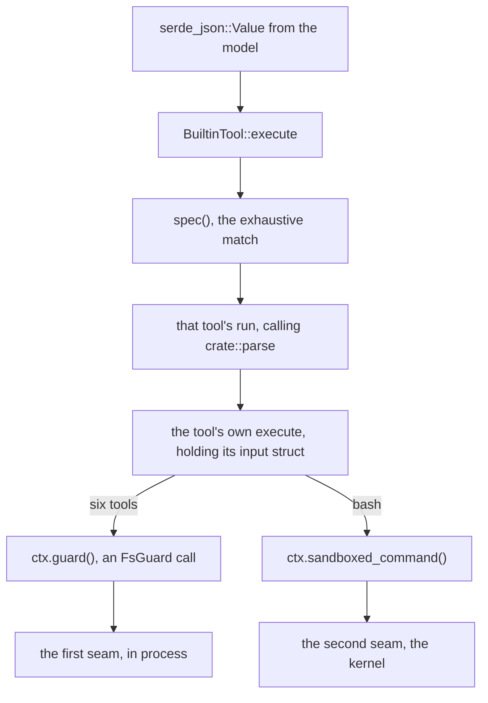

# `sandbx-tools` is seven modules and one match

This crate is two boxes of
[04 — the architecture](04-the-architecture.md)'s View 3: **the tool boundary**,
[`tools/src/lib.rs`](../../crates/sandbx-tools/src/lib.rs), and **the policy's
ownership**, [`tools/src/context.rs`](../../crates/sandbx-tools/src/context.rs).
It is also where View 2's fork in the road is written down — six built-ins turn
left into `FsGuard` and never leave the harness process, one turns right.

[15 — tools and the screen](15-tools-and-the-screen.md) is the conceptual half
and this chapter does not repeat it: what the seven *are*, why six are bounded
by work rather than by time, what "spends the policy rather than lends it"
means, and every place an eighth tool would be a compile error.
[11 — the two seams](11-the-two-seams.md) owns `FsGuard`;
[13](13-turn-loop-and-gate.md) owns what a `RiskLevel` is spent on. What is left
is the map underneath: twelve source files, what each holds, and — per tool —
the exact guard call it makes. [guide-tools.md](../guide-tools.md) is the
authority.

## The module tree

```
crates/sandbx-tools/
├── src/
│   ├── lib.rs        BuiltinTool, ALL, ToolSpec, ToolOutput, RiskLevel,
│   │                 and the five helpers the tool modules share
│   ├── context.rs    ExecutionContext — the guard, the private policy,
│   │                 the limits, the timeout
│   ├── limits.rs     ToolLimits: two output caps, two input caps
│   ├── error.rs      ToolError: Denied | BadInput | Failed | TimedOut
│   └── tools/
│       ├── mod.rs    seven `pub mod` lines and nothing else
│       ├── read.rs   write.rs  edit.rs   the three that touch one file
│       ├── ls.rs     grep.rs   find.rs   the three that list or walk
│       └── bash.rs                       the one that spawns
└── tests/
    ├── read.rs  write.rs  edit.rs  ls.rs one target per tool
    ├── search.rs                         grep and find share this one
    ├── bash.rs  spawn.rs                 kernel-gated
    ├── registry.rs                       the set, and lookup by name
    ├── limits.rs  scan_limits.rs         output caps, then input caps
    └── support/helper.rs                 a [[bin]] the spawn tests exec
```

[`Cargo.toml`](../../crates/sandbx-tools/Cargo.toml) names four dependencies and
no more: `sandbx-core`, `schemars`, `serde`, `serde_json`. No async runtime, no
`regex`, no `walkdir`. Tools are synchronous, and `sandbx-agent` owns the one
`spawn_blocking` site that calls them.

## `lib.rs`: a closed enum, and five shared helpers

The crate's entire public surface is seven items: `DEFAULT_TIMEOUT` and
`ExecutionContext` re-exported from `context`, `ToolError` from `error`,
`ToolLimits` from `limits`, and `ToolOutput`, `RiskLevel` and `BuiltinTool`
declared here. `ToolSpec` is `pub(crate)`, so a tool's *declaration* is not a
public shape.

What catches people is `mod tools;`, which is private. Each tool module declares
a `pub struct <Variant>Input` and a `pub fn execute` taking it by value, and the
privacy of their parent means neither is nameable from outside; the `pub` there
amounts to `pub(crate)`, and the workspace does not enable `unreachable_pub` to
say so. The only door in is `BuiltinTool::execute` with a `serde_json::Value`,
and that door is what the privacy buys. `execute` is `(self.spec().run)`, and
every module's `run` is `execute(crate::parse(input)?, ctx)`, so no route to the
filesystem skips the parse into that tool's own input struct, and none reaches a
tool without passing through the `BuiltinTool` whose `risk()` the gate reads. A
public `write::execute(WriteInput { .. })` would be a second door into a crate
`sandbx-cli` already depends on, and no gate would see it. Of the ten
integration targets, the eight that run a tool all come through the one door;
`registry.rs` only inspects the registry and `spawn.rs` goes at
`sandboxed_command` directly.

`BuiltinTool` itself is fieldless and `Copy`:

```rust
/// The tools an agent may call.
#[derive(Debug, Clone, Copy, PartialEq, Eq)]
pub enum BuiltinTool {
    /// Read a file.
    Read,
    /// Create or replace a file.
    Write,
    /// Run a shell command under the sandbox.
    Bash,
    // … Edit, Ls, Grep, Find
}
```

and `ALL` is the registry — there is no `ToolRegistry` type and nothing
registers at runtime:

```rust
    /// Every tool an agent can be offered.
    pub const ALL: [Self; 7] = [
        Self::Read,
        Self::Write,
        Self::Bash,
        Self::Edit,
        Self::Ls,
        Self::Grep,
        Self::Find,
    ];
```

What the closed enum buys over a list of `Box<dyn Tool>` is a *compile* error
instead of an omission. `[Self; 7]` is in the type; the private `spec` match is
exhaustive; and `tests/registry.rs` spells every variant out by hand twice, so
an eighth variant breaks the test binary too. A `dyn` registry would accept the
eighth tool by being handed it and accept its absence by not being handed it,
and both would compile. 15 lists everywhere an eighth tool lands.

The five facts about a tool live in one crate-private struct:

```rust
pub(crate) struct ToolSpec {
    name: &'static str,
    description: &'static str,
    risk: RiskLevel,
    schema: fn() -> serde_json::Value,
    run: fn(serde_json::Value, &ExecutionContext) -> Result<ToolOutput, ToolError>,
}
```

`schema` is a function rather than a value because `schema_for!` allocates and
so cannot be a `const`. `name`, `description`, `risk`, `input_schema` and
`execute` each call `spec()`, the single match over the enum, so the five
accessors have one place to be transposed in rather than five:

```rust
    fn spec(&self) -> ToolSpec {
        match self {
            Self::Read => tools::read::SPEC,
            Self::Write => tools::write::SPEC,
            Self::Bash => tools::bash::SPEC,
            Self::Edit => tools::edit::SPEC,
            Self::Ls => tools::ls::SPEC,
            Self::Grep => tools::grep::SPEC,
            Self::Find => tools::find::SPEC,
        }
    }
```

That is the whole of dispatch. Each arm names a `pub(crate) const SPEC` in that
tool's own module, so `spec()` copies two `&'static str`s, a `RiskLevel` and two
fn pointers and allocates nothing — which is what lets five accessors each call
it rather than cache its result. `execute` is one line more,
`(self.spec().run)(input, ctx)`. An eighth variant with no arm here is a compile
error before it is anything else.

The path end to end, from the model's JSON to whichever seam the tool stops at:



The rest of the file is the helpers the seven modules share, and reading them
first makes every tool module shorter than it looks:

| helper | what it does, and why it is here |
|---|---|
| `parse::<T>` | `serde_json::from_value`, mapping a mismatch to `BadInput` rather than panicking |
| `read_file` | `guard().open_read(path)`, then `read_to_string` on the **handle** — so no in-process tool can read a file by forgetting the check |
| `listing` | applies `take_entries`, *then* appends the partial-scan marker — inside the list it would be a line the cap could trim away; returns `"no matches"` only for a result both empty and complete |
| `guard_error` | one `SandboxError` → `ToolError` mapping for all six guard-using tools, with two arms of its own: `NotFound` becomes `Failed`, absence being the one verdict that is not a refusal (#180), and `RootReplaced` becomes `Denied` under a *rewritten* reason, its own `Display` naming the two `(dev, ino)` pairs the trail wants and the model cannot act on |
| `failed` | a host failure → `Failed`, with `verb` naming the attempt (`read /etc/hosts`) rather than the syscall |

`ToolOutput` is declared here too, wrapping the text the model will see behind a
private field so `new` is the only way in and an empty result is
unrepresentable; `guide-tools.md` has that invariant.

## The seven at a glance

| tool | input | guard call | risk | bound by |
|---|---|---|---|---|
| `read` | `{ path }` | `open_read` ×1 | `ReadOnly` | `max_bytes` (output) — no input cap |
| `write` | `{ path, content }` | `open_write` ×1 | `Writes` | nothing |
| `edit` | `{ path, old, new }` | `open_read` then `open_write` | `Writes` | nothing |
| `ls` | `{ path }` | `read_dir` ×1 | `ReadOnly` | `max_entries` (output) |
| `grep` | `{ path, pattern }` | `walk_readable` ×1, then `open_read` per candidate | `ReadOnly` | `max_files_scanned`, `max_bytes_scanned`, `MAX_FILE_BYTES`, `max_entries` |
| `find` | `{ path, name }` | `walk_readable` ×1 | `ReadOnly` | `max_files_scanned`, `max_entries` |
| `bash` | `{ command }` | none — `sandboxed_command` | `Executes` | `timeout` (process), `max_bytes` (output) |

Three things to read off that. `write` and `edit` consult **no** field of
`ToolLimits`. `grep` is the only tool making more than one *kind* of guard call.
And the risk column holds three values across seven rows, which is why the gate
is a category decision rather than a per-tool list.

Every schema is derived, never hand-written, and the derive makes each input
field's doc comment model-facing: schemars carries it into the schema's
`description` and the struct's name into its `title`. What it is *not* is a
constraint — every field in all seven schemas is `"type": "string"` and
`required`, with no `format` and no pattern. "Absolute path" is advice, and a
relative one is not refused: `FsGuard::check_read` calls `Path::canonicalize`,
which resolves it against the harness's own working directory.

All seven input structs are one shape — `Deserialize` and `JsonSchema` side by
side, every field `pub`, none an `Option`, and no `#[serde(...)]` attribute
anywhere in the crate:

```rust
/// Arguments for the `grep` tool.
#[derive(Debug, Deserialize, schemars::JsonSchema)]
pub struct GrepInput {
    /// Absolute path of the directory to search.
    pub path: PathBuf,
    /// Literal text to look for. Not a regular expression.
    pub pattern: String,
}
```

No `Option` means a *missing* field is `BadInput`, carrying serde's own wording
("missing field `pattern`") through `crate::parse`. An *extra* field is silently
dropped: no input struct sets `deny_unknown_fields`, and schemars emits
`"additionalProperties": false` only when it is set — so neither the schema the
model is shown nor the parse that reads its reply refuses an unknown key. The
model is the untrusted source of that JSON, so the permissiveness is paid for a
layer up rather than here. [13](13-turn-loop-and-gate.md)'s decoy-argument
section is where it is met: a `bash` call can carry a `path` beside its
`command`, so the gate names a call after its **tool** and never after whichever
key is present.

### `read`

[`tools/read.rs`](../../crates/sandbx-tools/src/tools/read.rs), thirty-eight
lines and the shortest tool here. `ReadInput` is one `PathBuf`; `execute` is
`crate::read_file` then `take_bytes`, so exactly one guard call — `open_read`,
made inside the shared helper. `ReadOnly`, so the gate's default answer is yes
with nothing asked, which makes `read` the tool most likely to run on text the
operator never saw. Its only bound is an *output* bound, applied after
`read_to_string` has already allocated the whole file; 15 and
[decision-bounding-tool-work.md](../decision-bounding-tool-work.md) both flag
that as the uncapped path in this layer.

The non-obvious part: an empty file does not come back empty. `ToolOutput::new`
turns it into `"(no output)"`, which `an_empty_file_is_reported_as_empty` pins
— otherwise "the file is empty" and "the tool printed nothing" are one string.

### `write`

[`tools/write.rs`](../../crates/sandbx-tools/src/tools/write.rs). `WriteInput`
is `{ path, content }`; one guard call, `open_write`, then `write_all` on the
handle. `Writes`, so under `--approve call` this is one of the tools an operator
is asked about every time. Nothing bounds it.

The non-obvious part is the truncation. `open_write` opens with
`create(true).truncate(true)`, so the file is empty the instant the handle
exists: a `write_all` that fails halfway leaves a file shorter than both the old
and the new content, reported as `Failed`. The success line reports
`input.content.len()`, the length of the string it was handed, not anything the
OS confirmed. `refuses_to_write_through_a_symlink_leaf` is the test to read —
the agent can plant symlinks anywhere it has write, and `O_NOFOLLOW` on the leaf
is what keeps the write inside the policy.

### `edit`

[`tools/edit.rs`](../../crates/sandbx-tools/src/tools/edit.rs). `EditInput` is
`{ path, old, new }`, and the body is mostly ordering: two guard calls, where
the order and the position of the second are both load-bearing.

The read comes first, "so a write-only grant fails before an error message can
disclose content" — read and write are granted independently, as
[12](12-a-flag-to-a-kernel-rule.md) establishes, so an edit on a read-only root
must fail even though its read half succeeded
(`read_grant_alone_does_not_permit_editing`). Then the write handle,
deliberately late:

```rust
    // The write handle truncates on open, so open only once the match is unique:
    // otherwise a refused edit empties the file it refused to edit.
    let updated = content.replace(&input.old, &input.new);
    let mut target = ctx
        .guard()
        .open_write(&input.path)
        .map_err(|error| crate::guard_error(&input.path, error))?;
```

`a_refused_edit_leaves_the_file_intact` fails on any rearrangement that opens
the handle before counting. The uniqueness rule is in the `SPEC` description
rather than left to be discovered: zero and two occurrences are both `Failed`,
never a silent no-op, because a model that believes an edit landed builds on it.

### `ls`

[`tools/ls.rs`](../../crates/sandbx-tools/src/tools/ls.rs). `LsInput` is one
path, and its guard call is the odd one in the crate — two nested `Result`s the
tool has to report apart:

```rust
    let entries = ctx
        .guard()
        .read_dir(&input.path)
        .map_err(|error| crate::guard_error(&input.path, error))?
        .map_err(|error| crate::failed("list", &input.path, error))?;
```

The outer is the policy's verdict and becomes `Denied`; the inner is the host's
and becomes `Failed`. `tests/ls.rs` covers both sides — one test on the
policy's, three on the host's (a missing directory inside a grant, a file where
a directory was asked for, a directory the host will not read) — and must not
collapse: one tells the model to ask for a different path, the others that the
path was fine and the filesystem was not. 11 explains why this is the guard call
that closes no TOCTOU window — a directory read has no `O_NOFOLLOW` handle form.

The non-obvious part: `ls` passes `stopped_early: false` unconditionally —
"Never partial: `ls` reads one directory, so there is no walk to cut off." It is
still subject to `max_entries`, so a huge directory comes back trimmed, but with
the *output* marker, which says the answer is complete and the display was cut.

### `grep`

[`tools/grep.rs`](../../crates/sandbx-tools/src/tools/grep.rs), the most
expensive tool and the only one with four bounds. `GrepInput` is
`{ path, pattern }`, and the pattern is a **literal** —
`line.contains(&input.pattern)`, not a regex. The doc comment on `execute`
justifies that: a regex adds a dependency and a class of pathological-pattern
behaviour, for a tool mostly asked where a symbol appears.

Two kinds of guard call: `walk_readable` once for the tree, then `open_read` per
candidate through `crate::read_file`. The loop head is where the input bounds
meet:

```rust
    for file in walk.files {
        // Before the read, so the budget bounds what is read rather than noticing
        // once it is spent. A file skipped below is not charged for.
        if scanned >= ctx.limits().max_bytes_scanned() {
            stopped_early = true;
            break;
        }

        if file.metadata().is_ok_and(|m| m.len() > MAX_FILE_BYTES) {
            continue;
        }
```

`max_files_scanned` goes into `walk_readable` and comes back as
`walk.truncated`; `max_bytes_scanned` is checked here, before each read, so one
file can overshoot the total, and `MAX_FILE_BYTES` — 2 MiB, a `const` in this
module and not a `ToolLimits` field, so no builder can move it — bounds that
overshoot. The skip reads `file.metadata()`, never the file, which is the whole
point of its doc comment: a pack file or a binary fails UTF-8 validation anyway,
and `read_to_string` discovers that only after allocating the whole thing.
`max_entries` trims the rendered hits. Either input bound sets `stopped_early`,
which `listing` turns into the partial-scan marker. Nothing is sorted, because
`walk_readable` returns files sorted and lines are visited ascending — sorting
the rendered `path:line: text` strings would put `:10` before `:2`.

- **Worth questioning:** the skip on a failed read.
  `let Ok(content) = crate::read_file(&file, ctx) else { continue };` discards
  the `ToolError` with no marker. The comment names the case it was written for
  — a binary under the size cap that fails UTF-8 validation — and silence is
  right for that. But `read_file` is the *guarded* read, so the same arm
  swallows every `Denied`: a grant substituted between the walk's single root
  confirmation and a per-file open (`RootReplaced`) comes back as "no matches".
  That is the confusion `decision-bounding-tool-work.md` built two markers to
  prevent — "a search that silently gave up looks identical to one that found
  4,000 matches and showed 200" — and the record reasons only about the budgets,
  never about a candidate the guard refuses mid-walk. The fix needs no new
  vocabulary: `stopped_early = true` on a `Denied` already renders as "results
  are incomplete".

### `find`

[`tools/find.rs`](../../crates/sandbx-tools/src/tools/find.rs). `FindInput` is
`{ path, name }`, `name` a substring and not a glob. One guard call,
`walk_readable`, and no file is ever opened — which is why `max_bytes_scanned`
does not apply and why it is far cheaper than `grep` over the same tree.
`walk.truncated` goes straight to `listing`, so a tree larger than
`max_files_scanned` is marked incomplete.

```rust
    // Matched against the name being reported, not the one it was reached by: the
    // model would otherwise get hits whose filename lacks what it searched for.
    let found = walk
        .files
        .into_iter()
        .filter(|path| {
            path.file_name()
                .is_some_and(|name| name.to_string_lossy().contains(&input.name))
        })
```

That comment is the non-obvious part: `walk_readable` includes a symlinked file
if it resolves inside an allowed root and yields the *resolved* location, so
matching on the name being reported is what keeps the result self-consistent.
`find` and `grep` share `tests/search.rs`, which asserts both inherit the walk's
confinement rule rather than re-implementing it.

### `bash`

[`tools/bash.rs`](../../crates/sandbx-tools/src/tools/bash.rs) is 299 lines,
more than three times the next-longest tool module, and the only tool that
crosses the *second* seam. `BashInput` is one `String`. There is no guard call
anywhere in the file, and that is the point: nothing here checks a path, because
Landlock, seccomp and the namespaces confine the command once it has `exec`'d.
11 owns that seam; [09](09-landlock.md) and [10](10-seccomp.md) own what gets
applied.

```rust
pub fn execute(input: BashInput, ctx: &ExecutionContext) -> Result<ToolOutput, ToolError> {
    let command = ctx
        .sandboxed_command("/bin/sh")
        .arg("-c")
        .arg(&input.command);

    let output = command
        .output()
        .map_err(|error| sandbox_error(&input.command, error))?;
```

Four facts about those nine lines. **The command reaches `sh -c` verbatim** — no
quoting, no parsing, no denylist; running arbitrary commands is the purpose, and
a metacharacter filter would be a second, weaker boundary over ground the first
already holds. **`/bin/sh` is a literal,** and it sits inside
`SYSTEM_EXECUTABLE_PATHS`, so a policy without `allow_system_executables` cannot
start anything at all. **`sandboxed_command` has already applied the timeout and
the helper override,** so `bash` cannot forget either; it never sees them. And
**the timeout bounds this tool and no other** — 15 is the chapter on why the
other six get nothing from it.

Most of the module's length is `sandbox_error`, `bash`'s answer to the question
`guard_error` answers for the other six. It matches exhaustively over
`HelperRefusal`: a program pin and a substituted grant are `Denied`, and every
refusal meaning the sandbox *would not apply* is `Failed`, because "refused by
the sandbox policy" would be false about a kernel that would not unshare (#185).
The separation is carried by the `subject` — ``sandbox `cmd` `` against
``run `cmd` `` — so a model cannot read a sandbox that never started as a
command that ran and exited non-zero. The unit tests at the foot of the module
walk every variant of `HelperRefusal::ALL`, including the one whose stderr is
lost. A non-zero exit is none of those: the output is combined, capped by
`max_bytes`, and folded into a `Failed` whose `detail` leads with the code.

- **Worth questioning:** that last classification. A non-zero exit becomes an
  error for the whole call, which is right for `cargo build` and wrong for the
  family where a status *is* the answer — `grep -q`, `diff`, `test -f`,
  `git diff --exit-code`. The model still receives the output inside `detail`,
  so nothing is lost there; what is lost sits upstream. `Outcome::Ran` is never
  recorded for such a call, so the operator's line reads "— failed:" and the
  trail agrees, about a command that did exactly what it was asked. `error.rs`
  states the split as being by the agent's next move, and the record has drawn
  this distinction once already in the other direction: `SandboxError::NotFound`
  moved out of `Denied` into `Failed` because the next move differed (#180). No
  equivalent reasoning exists for an exit code, and `surfaces_a_non_zero_exit`
  pins the behaviour without arguing for it. Carrying the status on a successful
  `ToolOutput`, and keeping `Failed` for a command that could not be run, would
  let `Ran` mean "ran" in the one record an operator reads afterwards.

## `context.rs`: the policy is a private field

Ninety-six lines, one type, and the shape is the enforcement:

```rust
#[derive(Debug, Clone)]
pub struct ExecutionContext {
    guard: FsGuard,
    policy: SandboxPolicy,
    helper: Option<std::path::PathBuf>,
    limits: ToolLimits,
    timeout: std::time::Duration,
}
```

Both halves of the sandbox in one value, because the built-ins split across
them. `new(policy)` builds the `FsGuard` from the policy and then moves the
policy in, where it is private (#56); three `#[must_use]` builders —
`with_helper`, `with_limits`, `with_timeout` — adjust the rest. 15 argues why
there is no `policy()` accessor; what this chapter adds is the signature list,
which is the entire API a tool meets:

```rust
pub fn limits(&self) -> &ToolLimits
pub fn guard(&self) -> &FsGuard
pub fn sandboxed_command(&self, program: impl Into<String>) -> SandboxedCommand
```

Three methods, no fourth. `sandboxed_command` is the only site in the crate that
touches `self.policy` — cloning it into `SandboxedCommand::new`, attaching the
timeout, attaching the helper path if one is set. So two sites build a
`SandboxedCommand` from a context: this method, and `bash::execute` calling it.

`with_helper` exists for one reason worth knowing before testing `bash`.
`SandboxedCommand` defaults to re-executing the current binary in helper mode,
which assumes that binary calls `dispatch_helper_mode` at startup; the shipped
`sandbx` does and a test harness does not. `tests/support/helper.rs` is the
stand-in — a `[[bin]]` named `sandbx-tools-test-helper`, declared with
`required-features = ["sandbox-integration"]`, whose `main` is one
`dispatch_helper_mode` call. `tests/bash.rs` and `tests/spawn.rs` reach it
through `env!("CARGO_BIN_EXE_…")` and are gated on that feature *and*
`target_os = "linux"`, so on a host with no sandbox-capable kernel those two
files compile to nothing and the other eight targets still run.

`ExecutionContext` is `Clone`, which is not decoration: `answer_calls` clones it
per call because `spawn_blocking` needs `'static`.

## `limits.rs`: four fields, and which tool reads which

```rust
#[derive(Debug, Clone, Copy, PartialEq, Eq)]
pub struct ToolLimits {
    max_entries: usize,
    max_bytes: usize,
    max_files_scanned: usize,
    max_bytes_scanned: usize,
}
```

All four private, with a `Default` whose every figure carries a comment naming
what it is calibrated against — and for `max_files_scanned` a second reason,
that the walk holds a `PathBuf` per file, so the cap bounds memory as well as
time. [guide-tools.md](../guide-tools.md) tabulates the same five figures beside
the rule each serves.

The accessor surface is asymmetric, and that is the fastest way to see which
bound is applied where:

| field | default | reader | how |
|---|---|---|---|
| `max_entries` | 200 lines | `ls`, `grep`, `find` | indirectly, via `take_entries` inside `crate::listing` |
| `max_bytes` | 256 KiB | `read`, `bash` | indirectly, via `take_bytes` |
| `max_files_scanned` | 10,000 files | `grep`, `find` | directly — `pub fn max_files_scanned()`, passed to `walk_readable` |
| `max_bytes_scanned` | 64 MiB | `grep` | directly — `pub fn max_bytes_scanned()`, compared in the loop |

The two output caps have **no** public getters: `take_entries` and `take_bytes`
are `pub(crate)`, so a tool cannot read a cap and apply it itself. The two input
caps do, because the tool is the only thing that can spend a budget as it goes.
All four have a `#[must_use] with_*` builder, so the asymmetry is about
*reading* a cap, not about tightening one — and the fifth figure, `grep`'s
2 MiB `MAX_FILE_BYTES`, has neither, being a `const` in `grep.rs`.
`take_bytes` backs up to a UTF-8 character boundary before cutting, a byte
offset being able to land mid-character.

Two test targets split along the same line as the fields. `tests/limits.rs`
covers the output caps and their markers; `tests/scan_limits.rs` covers the
input budget, which its module doc calls "all that bounds one broad search"
given the in-process tools have no clock. Each also asserts that a result
*within* a bound carries no marker — the half an over-eager fix breaks.

## `error.rs`: four variants, and why two must stay apart

Fifty-six lines: the enum, a `Display`, an `Error` impl. `Denied`, `BadInput`,
`Failed` and `TimedOut`, split — in the module doc's words — by the agent's next
move: ask for something else, call it correctly, read the detail, or narrow it.
`guide-tools.md` has that table. What is worth seeing here is the `Display`,
because for the model this *is* the error:

```rust
            Self::Denied { subject, reason } => {
                write!(f, "refused by the sandbox policy: {subject} ({reason})")
            }
            Self::BadInput { detail } => write!(f, "invalid tool arguments: {detail}"),
            Self::Failed { subject, detail } => write!(f, "{subject} failed: {detail}"),
            Self::TimedOut { subject, after } => {
                write!(f, "{subject} timed out after {after:?} and was killed")
            }
```

So why must `Denied` stay distinct from `Failed`, when the model only ever sees
one string? Because the model is not the only reader, and it is the least
consequential one.

- **The model** gets `to_string()` inside a `tool_result` with
  `is_error: Some(true)`. Collapsing the two would change the wording, not the
  shape.
- **The operator** gets a line from
  [`cli/src/agent/gate.rs`](../../crates/sandbx-cli/src/agent/gate.rs), whose
  `report` matches `Outcome::Errored(error)` over all four variants
  individually: `Denied` renders "— refused by the policy: …", `Failed` renders
  "— failed: …". The comment says why it is a match rather than a `to_string()`
  — the error's own `Display` names its subject, which the head of the line has
  already printed from the arguments.
- **The trail** inherits that split, so "the policy refused this" and "the
  policy allowed it and it went wrong" stay two records (#169).

Collapse them and the model reads roughly the same sentence while the operator
loses the difference between a boundary doing its job and a boundary never
consulted.

## How a result reaches the model

At the type level the hand-off is one block, in
[`agent/src/turn/tools.rs`](../../crates/sandbx-agent/src/turn/tools.rs):

```rust
                ContentBlock::ToolResult {
                    tool_use_id: id.clone(),
                    content: output.into_content(),
                    is_error: None,
                }
```

`ToolOutput::into_content` consumes the wrapper and yields the `String`, which
is why that method exists beside `content()`. The error path calls a local
`refused` helper building the same block from `error.to_string()` with
`is_error: Some(true)`. So `ToolOutput` and `ToolError` are the two things this
crate produces, and the agent crate turns both into one
`ContentBlock::ToolResult`, one per `tool_use` block, in the order the model
asked. The block carries a `String`, not a `ToolOutput`: `sandbx-tools` does not
depend on `sandbx-providers` and does not know what a `tool_result` is. The same
file holds `definition`, which builds a `ToolDefinition` from `name()`,
`description()` and `input_schema()`. [02](02-what-a-harness-is.md) owns the
wire protocol and [13](13-turn-loop-and-gate.md) the round that sends it.

## Where the tests are

Ten integration targets and one `#[cfg(test)]` module, which is the ratio
[guide-module-layout.md](../guide-module-layout.md) asks for: the in-crate
module is in `bash.rs` and tests `sandbox_error`, a private function with no
behaviour observable from outside. Everything that *is* observable is tested
from outside, through `BuiltinTool::execute`.

| target | asserts |
|---|---|
| `read.rs`, `write.rs`, `edit.rs`, `ls.rs` | one tool's public contract each, dwelling on refusal |
| `search.rs` | `grep` and `find`, that they inherit `walk_readable`'s confinement |
| `registry.rs` | the set: `ALL`, `from_name`, names, schemas, risks, descriptions |
| `limits.rs` | the output caps, and the markers |
| `scan_limits.rs` | the input budget, and that a search inside it is unmarked |
| `bash.rs`, `spawn.rs` | the policy reaching a spawned command — both kernel-gated |

Read `tests/registry.rs` once even if you never touch this crate, for a reason
that generalises: where a test could read its expectation off the registry it
spells it out by hand instead, because an expectation derived from the same
`SPEC` would assert only that the code agrees with itself —
`the_risk_each_tool_carries_is_documented` says so in as many words. `Self::Ls
=> schema_for!(GrepInput)` compiled and shipped (#55); a symmetric swap of two
tool names stays unique and still round-trips through `from_name`, which is how
#88 went unnoticed through a green suite. The same file pins `RiskLevel`'s
*variant order*, because the gate admits everything at or below a level and
alphabetising the enum would keep every other test green while inverting the
meaning of each `<=`.

## You should now be able to explain

- Why the public surface is seven items, and why a tool's `pub fn execute` is
  not one of them.
- What `ALL: [Self; 7]` and the exhaustive `spec` match buy that a list of
  `Box<dyn Tool>` would not, and what `spec()` costs to call five times.
- Which `FsGuard` call each of the six in-process tools makes, and which one
  makes two kinds.
- What happens to an extra field in the model's JSON, and which layer pays for
  that rather than this one.
- Why `edit` reads before it counts, and counts before it opens the write
  handle.
- Why `ls`'s guard call returns two nested `Result`s, and what each layer
  becomes.
- Which `ToolLimits` field each tool reads, what it defaults to, and why the
  output caps have no public getters while the input caps do.
- What `bash` does not do that the other six do, and what confines it instead.
- Why `Denied` must stay distinct from `Failed` when the model sees one string
  either way.

## Next

[20 — the providers crate](20-crate-providers.md), the other half of what
`sandbx-agent` depends on: the vendor boundary, the event stream, and the one
row of that boundary nothing mechanical holds. The authorities *this* chapter is
an on-ramp to are [guide-tools.md](../guide-tools.md) and
[decision-bounding-tool-work.md](../decision-bounding-tool-work.md).
