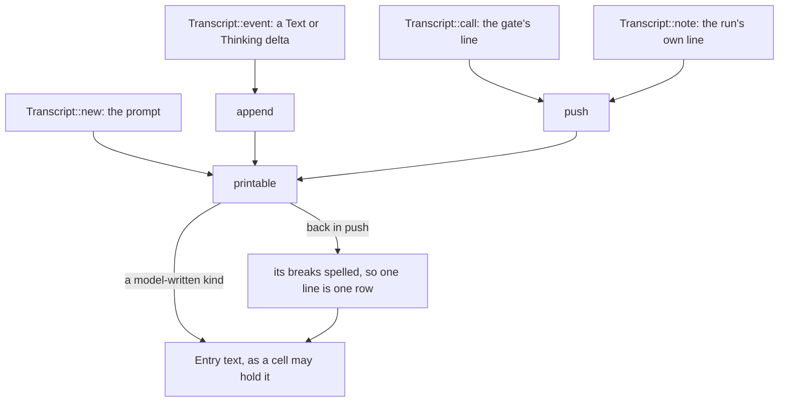
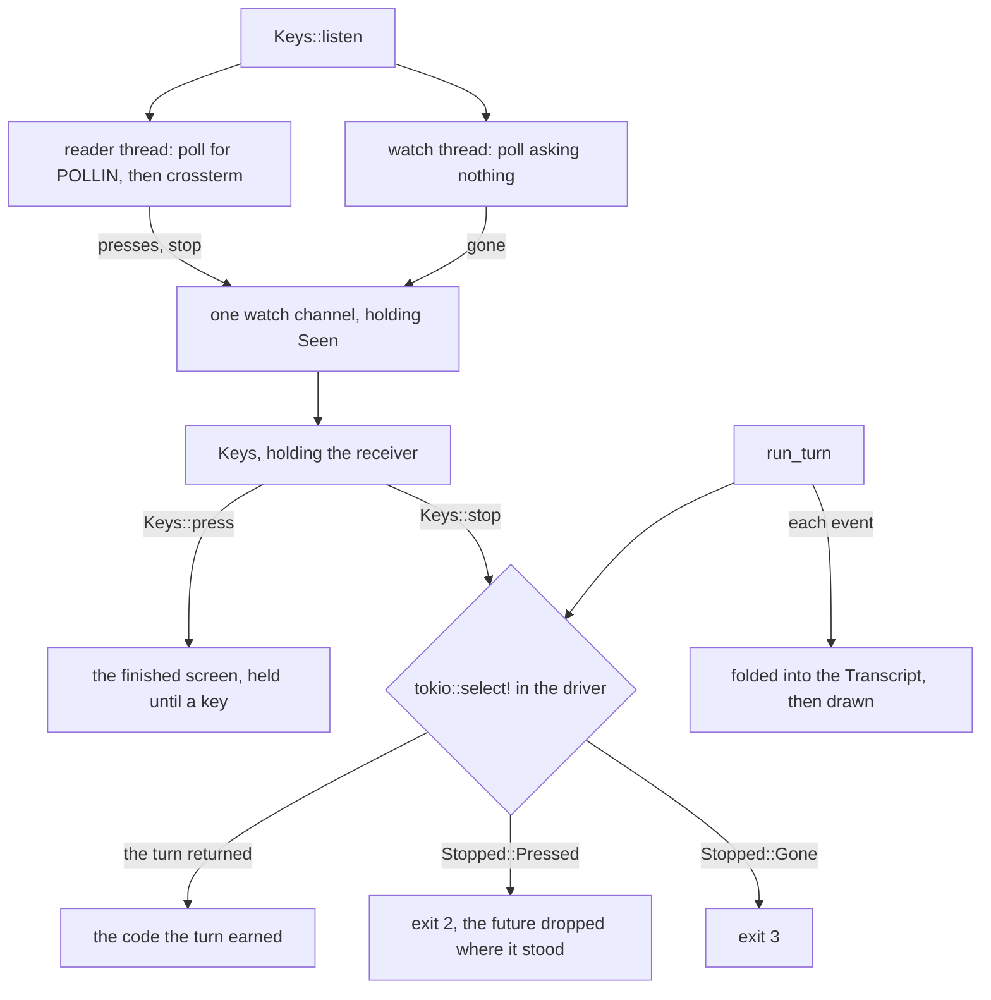

# The tui crate decides nothing, and sanitises everything it draws

[`sandbx-tui`](../../crates/sandbx-tui/) is the screen one turn is drawn on and
the keys that stop it: five source files, about fourteen hundred lines. In
[04 — the architecture](04-the-architecture.md) it is the box a turn is
*reported* in, and the one crate with no row in View 3's table of boundaries —
no policy, no gate, no session, no client. 04 also sets the frame: `tui` is
not a sixth subcommand but `agent-run`'s flags derived into the same policy,
reported elsewhere.

What the screen draws, and what interrupting a turn loses, belongs to
[15 — the seven tools and the screen](15-tools-and-the-screen.md) and to
[guide-tui.md](../guide-tui.md), the authority. This chapter is the map
underneath: which file holds which type, what is `pub` and what deliberately is
not, where the tests are, and one security property that belongs to this crate's
*manifest*. The **driver** is [24](24-crate-cli.md)'s — `cli/src/agent/tui.rs`
enters the screen, starts the key reader, races the turn against a keypress and
overrides the gate's `settled`.

## The module tree

```
src/lib.rs          re-exports five names; no policy, no gate, no session here
   transcript.rs    AgentEvent folded into entries, and the control bytes a cell
                    may not hold — no terminal behind it, so it is unit-tested
   view.rs          the layout: the transcript tail-aligned over a status bar
   screen.rs        Screen — raw mode and the alternate screen, put back on drop
   input.rs         Keys — the reader thread, and the press a turn awaits
```

| module | what it holds | covered in |
|---|---|---|
| [`lib.rs`](../../crates/sandbx-tui/src/lib.rs) | four `mod` lines and four `pub use` lines — the whole public surface | here |
| [`transcript.rs`](../../crates/sandbx-tui/src/transcript.rs) | `Transcript`, `Entry`, `Kind`, `printable` — the fold, and the sanitiser | here, as the centre; [15](15-tools-and-the-screen.md) for why a renderer gets a security chapter |
| [`view.rs`](../../crates/sandbx-tui/src/view.rs) | `draw`, `Hint`, `GUTTER_MARK` — rows, styles, the status bar | here for the layout; [guide-tui.md](../guide-tui.md) owns the gutter argument |
| [`screen.rs`](../../crates/sandbx-tui/src/screen.rs) | `Screen` — raw mode, the alternate screen, the `Drop`, the latched failure | here |
| [`input.rs`](../../crates/sandbx-tui/src/input.rs) | `Keys`, `Seen`, `Stopped`, `interrupts` — the two threads and the two awaits | here; [15](15-tools-and-the-screen.md) for what the interrupt costs |

Tests are inline, in the file whose private items they touch, as
[guide-module-layout.md](../guide-module-layout.md) asks: `transcript.rs`,
`view.rs` and `input.rs` carry a `mod tests`, there is no
`crates/sandbx-tui/tests/` directory, and `screen.rs` has none — it is the one
file that needs a real terminal.

## lib.rs is five names, and the manifest is the interesting half

Four `mod` lines and four `pub use` lines — one of them now binding two
items — and no `pub mod`, so no module path is part of the API: a caller gets
five names and their methods — `Transcript::new`/`event`/`call`/`note`,
`Screen::enter`/`draw`/`redraw`/`failure`, `Keys::listen`/`stop`/`press`,
`Stopped::Pressed`/`Gone`, `Hint::Running`/`Done`. Deliberately *not*
exported is the shape of a transcript: `Entry` and `Kind` are `pub(crate)`,
as are `Transcript::entries`, `rounds`, `tokens` and `view::draw`. The only
way out of a `Transcript` is a drawn frame, so no caller can read the folded
entries back and print them where the fold does not cover.

The dependency edges are the second half of
[`Cargo.toml`](../../crates/sandbx-tui/Cargo.toml).

```toml
ratatui = { version = "=0.30.2", default-features = false, features = [
  "crossterm",
  "unstable-rendered-line-info",
] }
# `poll` alone: the key reader gates every call into crossterm on a `poll`, which is
# the only place a hung-up terminal can be seen — crossterm swallows `POLLHUP` and
# spins on the zero-byte read behind it (#264).
nix = { version = "0.31.3", default-features = false, features = ["poll"] }
sandbx-providers = { path = "../sandbx-providers" }
# `sync` alone: the key thread reaches the turn through a watch channel, and
# nothing here spawns a task or arms a timer.
tokio = { version = "1.53.1", default-features = false, features = ["sync"] }
```

One internal crate. `nix`'s `poll` feature is the production edge the hangup
fix added (#264) — the key reader's whole mechanism for seeing a terminal
that stopped answering, below and in
[guide-tui.md](../guide-tui.md). The dev profile repeats `nix` with `term`
added, for opening a pty pair and reading its termios in a test, and keeps
`serde_json` beside it. Read the one internal edge as a negative fact stated
at the type level: **a renderer cannot leak what it cannot name.** With no
edge to `sandbx-core`, `sandbx-tools`, `sandbx-agent` or `sandbx-session`,
nothing here can mention a `SandboxPolicy`, an `ExecutionContext`, a
`BuiltinTool`, a `CallGate` or a session transcript — not "does not" but
cannot, as a build error. The borrowed vocabulary is two types:
`transcript.rs` names `sandbx_providers::AgentEvent`, and its tests name
`StopReason`.

- **Worth questioning:** how much of that the dependency graph carries. Four
  crates' vocabulary is ruled out by a missing edge; the rest is not.
  `sandbx-providers` also exports `AnthropicClient` and
  `anthropic_api_key`/`resolve_api_key`, so the renderer *can* name the client
  and the credential resolver, which makes
  [guide-repo-map.md](../guide-repo-map.md)'s "nothing here knows of a policy or
  a provider" exact about the first half and loose about the second —
  discipline, where for the policy and the gate it is the compiler.
  [decision-provider-seam.md](../decision-provider-seam.md) argues by its own
  method: it sealed the vendor boundary by leaving `Prompt` without a
  `Serialize`, so nothing above `anthropic.rs` *can* post a neutral type. The
  same move is open here — the two event types in a crate of their own — priced
  against an eighth crate in a workspace whose seven are a feature.

## transcript.rs is the fold, and the fold is a sanitiser

The file to read, and the only one in the crate with a decision in it.
`Transcript` holds the `Vec<Entry>` in arrival order, a `show_thinking` flag, a
`rounds` counter and `tokens`, a pair of `Option<u32>`. An `Entry` is a `Kind`
and a `String`, and `Kind`'s five variants — `Prompt`, `Answer`, `Reasoning`,
`Call`, `Note` — are the crate's only classification, the view styling and
guttering by them.

Two fields exist because of the API rather than the screen. `rounds` is counted
off `Stop` events, since "no event carries the turn's own bound" — the screen
can say how many rounds happened, not how many were allowed. `tokens` is two
`Option`s rather than a struct because the API omits either independently, a
reported zero being a figure where an absence must not take a shown one back off
the screen (`an_unreported_count_is_not_a_reported_zero`).

### The fold is exhaustive, so a new event has to be decided here

```rust
    /// Fold one event in. A reasoning block and a redacted one are dropped, both carrying
    /// replay material that must not render.
    pub fn event(&mut self, event: &AgentEvent) {
        match event {
            AgentEvent::Text { delta } => self.append(delta, Kind::Answer),
            AgentEvent::Thinking { delta } if self.show_thinking => {
                self.append(delta, Kind::Reasoning);
            }
            AgentEvent::Stop { .. } => self.rounds += 1,
```

`AgentEvent` has seven variants and the match names every one with no `_` arm,
so an eighth is a compile error here. Three arms drop, and each is a decision:

- **`ThinkingBlock` and `RedactedThinking` are never entries.** Both carry
  replay material whose rule is "never log, render or store it", and a renderer
  is exactly the thing that would. [02](02-what-a-harness-is.md) and
  [decision-thinking-replay.md](../decision-thinking-replay.md) own why; the pin
  is `no_replayable_reasoning_block_is_ever_an_entry`, which folds a `Text`
  event first and asserts that produced something, so a fold that dropped
  everything could not pass it.
- **`Thinking` is gated on the flag, not on the event's absence**, the API
  sending the delta regardless of what was asked for.
- **`ToolCallRequested` draws nothing**, a requested call still being refusable.
  Only a settled one gets a row, arriving through `Transcript::call` from the
  caller's gate; the test feeds a `bash` call carrying `rm -rf /`.

Deltas coalesce: `append` extends the last entry when the kind matches and opens
a new one otherwise, so a `Call` row splits the answer where it happened.

### The bytes a cell may not hold

The threat first, because it is not cosmetic. Model output is
attacker-influenced text: a prompt injection in a file the agent read comes back
through the model and into the pane, and ratatui writes a cell's content to the
terminal as it was given. A surviving escape sequence could reposition the
cursor, rewrite the rows above itself — the account of what a tool just did
included — or set the terminal's title. The module doc draws the conclusion:
"model-chosen text is stripped here, not at the caller, because the screen is
what an escape sequence inside it would rewrite". `printable` is the stripper:

```rust
fn printable(text: &str) -> String {
    let mut out = String::with_capacity(text.len());

    for c in text.chars() {
        match c {
            '\n' => out.push('\n'),
            '\t' => out.push_str("    "),
            c if c.is_control() || invisible(c) || forgeable(c) => out.push('\u{fffd}'),
            c => out.push(c),
        }
    }
```

Every string that becomes entry text goes through it: the opening prompt in
`new`, each delta in `append`, every `call` and `note` line in `push`. Four
classes: `\n` survives because the view splits rows on it, `\t` becomes spaces
because nothing renders a cell holding one, and `is_control` and the two
denylists below all become U+FFFD.

`push` does one thing more: after `printable` it replaces `\n` with a literal
`\\n` for the two harness-written kinds. `Call` and `Note` are marked on *every*
row, so a kept break would mint a second marked row from whatever followed it —
which is how a provider error, whose text is the vendor's string verbatim, would
otherwise smuggle a row in.

Four ways text becomes a cell, and one function between all of them and the
screen:



`invisible` is the bidi-and-zero-width denylist, and it is literally the same
function [13](13-turn-loop-and-gate.md) meets at the approval prompt:
`sandbx_providers::invisible`, imported here beside `AgentEvent`.
`char::is_control` is category `Cc` exactly, so U+202E and the directional
isolates pass it and a line can *display* as a different line — in this pane
and the same `sandbx: ` grammar as the gate's own account, which is why one
table and not two. [20](20-crate-providers.md) has why the owner is a crate
that talks to an HTTP API, and what the two sinks deliberately do not share:
each keeps its own replacement, there being no one answer to what belongs in a
cell versus a line.

`forgeable` has no counterpart at the prompt, and is this crate's own:

```rust
fn forgeable(c: char) -> bool {
    matches!(
        c,
        // Every Box Drawing codepoint with a vertical stroke and no horizontal one: both
        // weights, the three dash densities, the double, and the half-height stubs. Its
        // horizontals are left alone, a table or a `tree` being ordinary output.
        GUTTER_MARK
        | '\u{2503}' | '\u{2506}' | '\u{2507}' | '\u{250a}' | '\u{250b}'
        | '\u{254e}' | '\u{254f}' | '\u{2551}'
        | '\u{2575}' | '\u{2577}' | '\u{2579}' | '\u{257b}' | '\u{257d}' | '\u{257f}'
        // The bracket, box-line and integral extensions, drawn to tile vertically.
        | '\u{239c}' | '\u{239f}' | '\u{23a2}' | '\u{23a5}' | '\u{23aa}' | '\u{23ae}'
        | '\u{23b8}' | '\u{23b9}' | '\u{23d0}'
        // Unicode's confusable mappings for the mark.
        | '\u{00a6}' | '\u{01c0}' | '\u{2016}' | '\u{2223}' | '\u{2225}' | '\u{2758}'
        | '\u{fe31}' | '\u{ff5c}' | '\u{ffe8}'
    )
}
```

`GUTTER_MARK` is the first entry in its own denylist, imported from `view.rs` so
the strip and the draw cannot disagree about the character — pinned by
`the_drawn_gutter_is_the_mark_the_transcript_strips`. Everything after it draws
the same cell. Why one pane needs an authenticated row at all is
[15](15-tools-and-the-screen.md)'s argument and
[guide-tui.md](../guide-tui.md)'s.

### The same hazard, three surfaces, three answers

| surface | model text is | why |
|---|---|---|
| `agent-run`'s stdout | verbatim — `render.rs` does `self.write(delta.as_bytes())` | stdout is the deliverable, and [13](13-turn-loop-and-gate.md) prices the trade |
| the `--approve call` question | `gate::stripped`: `\n` and `\t` **spelled** `\\n`/`\\t`, the rest U+FFFD | a heredoc shown as a row of U+FFFD is a command consented to unread |
| a cell | `printable`: `\n` **kept**, `\t` to spaces, the rest U+FFFD, plus `forgeable` | the view needs the break as a split point, and one pane carries two voices |

The weakest handling is on the surface with no screen state to corrupt; the two
that render a claim both strip, and both replace rather than delete for the same
reason — dropped, a hostile string reads as plausible prose. Stripping is
idempotent, so a per-call line stripped by `gate::line` and again at the cell
composes.

- **Worth questioning:** the gutter authenticates sandbx's voice and nothing
  authenticates the operator's. `view::gutter` draws two marks: `│ ` on a
  verdict or a note, `> ` on the prompt's first row. `forgeable` covers the
  first — a hand-written denylist of 33 codepoints, which is a different thing
  from every character that draws that cell, and the gap between the two is the
  shape of the risk rather than a bug in any one entry. What closed most of it
  was giving the list a scope a reader can check against Unicode's names instead
  of an enumeration to trust, and three tests that sweep it (#276); what keeps
  it open is that a property lookup, which is what "every character" would need,
  is a new dependency. `>` is ASCII and let through deliberately, on
  `GUTTER_MARK`'s own reasoning that "`|` or `>` is plausible in prose, and
  stripping either would mangle shell pipelines". For `|` the trade has a
  backstop — the real mark is a different character, and the guide notes that a
  box-drawing vertical joins across rows where a `|` leaves a gap — and for `>`
  there is none, which is where `guide-tui.md`'s defence of the wrapped row,
  "an unmarked row claims nothing", bites: a continuation row carries no gutter
  and starts in column 0, so a row beginning `> ` renders in the operator's own
  grammar. Weaker than forging a verdict — misattributed authorship rather than
  consent, and the wrap has to land immediately before the mark, which a model
  that cannot see the pane's width can only spray for. Not nothing either, the
  pane being the only record a `bash` call's text gets (#234), and the guide
  already names the fix for the other mark: a gutter in an area of its own.

### Where the tests are, and why they can be here

`Transcript` is a pure fold — events in, entries out, no terminal and no clock —
so the crate's security-relevant file is also the one with real coverage: what
an event becomes is an `assert_eq!` on a `Vec<Entry>`, and the sanitiser is a
free function over `&str`. Inline in
[`transcript.rs`](../../crates/sandbx-tui/src/transcript.rs),
`an_escape_sequence_in_the_answer_does_not_survive_the_fold` folds
`"done\x1b[2Jgone\r\x07"` and asserts the exact replacement, so the `[2J` that
survives as ordinary text is visible in the expectation; two more cover the
reordering characters and the gutter confusables, each asserting
`!c.is_control()` of its own inputs to keep the justification for `invisible`
and `forgeable` inside the test. Three more sweep `forgeable`'s scope rather
than spot-checking it: the 15 Box Drawing verticals, the 113 the carve-out
keeps, and the extensions and confusables outside that block. A codepoint
added to the function and not to a test now fails one.
[`view.rs`](../../crates/sandbx-tui/src/view.rs) draws state and reads none, so
its tests render into ratatui's `TestBackend` and read cells back as rows of
strings — which is how `an_answer_cannot_forge_the_row_a_verdict_is_drawn_on`
can assert that exactly one row starts with the mark. What no test reaches
is `Screen::enter` and crossterm's reader itself — the loop around it in
`input.rs` is tested through a private `Source` fake, and neither of the two
still untested holds a decision, which is the order to take that in.

## view.rs tail-aligns, and loses nothing it could show

Two areas from one `Layout::vertical`: `Constraint::Min(0)` for the body,
`Constraint::Length(1)` for the status bar. The body is one `Paragraph` with
`Wrap { trim: false }` holding the whole transcript, a blank row between
entries, each row prefixed by its kind's gutter, and styled with `Modifier`s
rather than colours — with no palette a colour falls back to the default
foreground, making a reasoning line and a refusal read alike.

"Tail-aligned" is three lines, and the comment above them is the part to keep.

```rust
    // Auto-follow is measured after wrapping, not counted off entries: a wrapped answer has
    // more rows than newlines, and scrolling by the smaller figure strands the tail off-screen.
    let rows = paragraph.line_count(body.width);
    let scroll = u16::try_from(rows.saturating_sub(usize::from(body.height))).unwrap_or(u16::MAX);

    frame.render_widget(paragraph.scroll((scroll, 0)), body);
```

`line_count` is why the manifest pins ratatui exactly and enables
`unstable-rendered-line-info`: measuring after wrapping is the alternative to a
second word-wrapper that would have to agree with ratatui's to the row.

- **A long line wraps rather than truncating**, a truncated line being
  unrecoverable — no scroll key, no scrollback behind the alternate screen.
  `a_line_wider_than_the_pane_wraps_rather_than_truncating` asserts it, and
  shows the continuation row starting in column 0 with no gutter.
- **The scroll is recomputed from the whole transcript every frame**, so nothing
  is consumed by being drawn and a terminal *grown* mid-turn brings scrolled-off
  rows back on the next repaint. The offset is a `u16` and clamps there.
- **Nothing is lost permanently; it is lost to the operator.** Every entry stays
  in the `Vec` for the `Transcript`'s life, but with auto-follow only no key
  brings a scrolled-off row back, and the alternate screen takes it when it is
  given back — which for a `bash` call is the only place the command's text
  appeared (#234).

The status bar is `rounds N`, the token figures if any arrived, and one `Hint`,
joined with ` · ` and drawn `REVERSED`.

## screen.rs takes the terminal, and `Drop` gives it back

`Screen::enter` installs a panic hook and then takes the terminal, in that
order. The hook first because of what it replaces: `ratatui::try_init` restores
with `restore`, whose `eprintln!` on a failed `tcsetattr` panics on a terminal
that cannot be written to, and a panic raised inside a hook is a panic while
panicking, which aborts (#264). `enter`'s own hook calls `try_restore` instead
and then the hook that was in force before — and it goes on before anything
fallible, which is more than replacing ratatui's after the fact could manage:
`try_init` installs its hook as its own first statement, so a panic in the three
after it had the aborting one in force (#270).

So `enter` does not call `try_init`. `take_terminal` reproduces its other three
statements — raw mode, then the alternate screen, then `Terminal::new` — in that
order, "so a failed second step leaves the first in force", and the ratatui
dependency is pinned exactly (`=0.30.2`) because that is a copy of a function
body in `init.rs`. `clippy.toml` bans `restore`, `init`, `init_with_options` and
`run`, so reintroducing any of them is a build failure rather than a review
miss. A failed `take_terminal` still restores, for the reason `Screen::drop`
gives below: a terminal that cannot be entered may be one that cannot be
reported to either. Raw mode is
not a convenience: it is what makes ctrl-c arrive at `Keys` as a `KeyEvent`
rather than raising `SIGINT`, which is why `Keys::listen` is started after
`enter` and never before.

`enter` is reached only on a run that can be drawn at all, and the driver
settles that first: `Tui::drawable` refuses `--approve call`
(`AgentError::ApproveUnderTui`, #225) and then a stdout that is not a terminal
(`AgentError::NotATerminal`), the flag first "being the more specific" where one
invocation has both wrong. Both land before the policy is derived and before the
credential is read — "a run that cannot be drawn must not read a credential on
the way to finding that out" — and `drawable` takes the terminal answer as a
`bool` argument rather than reading file descriptor 1, which under `cargo test`
is the developer's own. [24](24-crate-cli.md) owns the subcommand.

Giving it back is the mechanism:

```rust
impl Drop for Screen {
    /// Leave raw mode and the alternate screen, whatever the turn did.
    ///
    /// `Drop`, not a method: an unwinding panic must still restore the terminal, which
    /// [`Screen::enter`]'s hook covers only earlier. Neither covers `SIGKILL`.
    ///
    /// `try_restore` and not `restore`: `restore` reports a failed `tcsetattr` with
    /// `eprintln!` to the descriptor that just died, and that panic inside an unwinding
    /// `Drop` aborts (#264).
    fn drop(&mut self) {
        // Ignored: there is nothing left to report a terminal that stopped answering to.
        let _ = ratatui::try_restore();

        if let Some(terminal) = self.terminal.take() {
            // `Terminal::drop` `eprintln!`s when it cannot show the cursor a draw hid, which
            // is the same panic from inside this `Drop`. Contained rather than prevented:
            // `show_cursor` clears the flag `Drop` reads only once the backend accepted it,
            // which a dead one never will.
            let _ = std::panic::catch_unwind(AssertUnwindSafe(move || drop(terminal)));
        }
    }
}
```

A panic anywhere in the turn — the fold, a gate line, the driver — would
otherwise leave the operator in raw mode with no echo, on an alternate
screen, in a shell that still works and shows nothing it is told. Unwinding
runs `Drop`, so the panic message lands on a usable terminal — except where
stderr is the very descriptor that stopped answering, which is why
`try_restore` replaces `restore` above. The field became an `Option` for a
second such write: ratatui's own `Terminal::drop` `eprintln!`s when it
cannot show a cursor a draw hid, on the same dead descriptor, and that one
cannot be prevented from here — only contained, by dropping the terminal
inside a `catch_unwind`.

The limit is the first doc comment's last sentence, and it generalises past
`SIGKILL`: a `Drop` impl does not run on `SIGKILL` or `SIGSTOP`, on
`std::process::abort`, or in a `panic = "abort"` build — and a panic the
`catch_unwind` above does not reach still double-panics and aborts, same as
before. Each leaves the terminal as the turn left it, `reset` in the shell
the only fix — the same shape as the held audit trail losing everything to
a signal that runs no `Drop` (#235).

Two draw methods and a latch. `draw` repaints from the transcript; `redraw`
discards the back buffer first by resizing to the size already in force,
since ratatui flushes only the diff between its two buffers and a cell a
third party wrote would never be rewritten. The comment records the trap:
not `Terminal::clear`, whose cursor query takes crossterm's one reader lock,
which `Keys` may be holding — and if it wins the lock instead, it races the
reader for the reply bytes rather than deadlocking against it, now that the
reader holds that lock only while an event is in flight and not for as long
as it parks.

Both return `()` because the seam they are called through cannot carry an error:
`run_turn`'s observer is `O: FnMut(&AgentEvent)`, so the closure that folds an
event and repaints has nowhere to put an `io::Error` — which is what the field's
own doc means by "`observe` having nowhere to return one". So the first one
latches instead:

```rust
    pub fn draw(&mut self, transcript: &Transcript, hint: Hint) {
        if self.failed.is_some() {
            return;
        }

        if let Err(error) = self
            .terminal()
            .draw(|frame| view::draw(frame, transcript, hint))
        {
            self.failed = Some(error);
        }
    }
```

`redraw` tests the same flag and latches the same way, so one failure stops
both. The field keeps the *first* error and not the last — "a closed stdout
fails once per event, and the last says only that it was gone" — and the caller
takes it once:

> The draw failure that stopped the screen updating, if one did. Taken, so a
> caller reports it once — and it must: everything after it happened off-screen,
> and a turn whose tool calls nobody saw was not watched.

The error is available, then, but only by asking: a turn whose screen died in
round one runs on under the policy it was given, every later call drawn into
nothing. No consent is bypassed — `tui` refuses `--approve call` (#225), so its
gate's decision is argv's — and what is lost is the watching. Nothing acts on
`failure()` before the turn ends: [24](24-crate-cli.md)'s `Tui::drive` takes it
after the final redraw and after the key that holds the finished screen, and
hands it to `reported` beside the code the turn earned.

What `reported` does with that pair is worth reading closely, because it is
one rule stated twice in this repo. A latched failure is **one more stderr
line and not the code.** It runs `code?` first, so a turn that failed
outright reports its own error and prints nothing else; then the account,
each line written with `writeln!` into a stderr taken once rather than
`eprintln!`'s implicit one, since under a hangup that same descriptor can be
the one that just died (#264); then the screen's failure, through
`AgentError::Screen`'s own `Display` so the wording is the one `main` would
have printed; and it returns the code regardless. A turn cut short at
`--max-rounds` therefore exits 2 and one that lost its operator exits 3,
whatever the screen did last.

The reason is in [guide-tui.md](../guide-tui.md): the code answers what the
*turn* did, and a draw that failed is not something the turn did — the stop, the
bounds and the lost operator are all decided before `failure()` is read, and the
account naming them reaches stderr either way. `agent-run` does the opposite
with `AgentError::Output`, and is right to, because there stdout *is* the
channel the answer came back on. That is the distinction to carry away: a
failure of the result channel may take the code, a failure of the view may not.

**What a frozen screen does lose is the answer, and no code can say so.** `tui`
draws the model's prose and the per-call lines to the screen and nowhere else —
not stdout, and the per-call account deliberately not stderr (#224) — so without
`--session` a run whose screen latched mid-turn exits 0 with its text gone, the
`drawing the screen:` line being the only tell. Both
[guide-tui.md](../guide-tui.md) and
[decision-approval-gate.md](../decision-approval-gate.md) state that where they
state the codes, rather than leaving it to be discovered. The alternative of
keying the code off the latch reports a lost operator as a generic failure, and
keying it off whether a session was open gives one turn outcome two codes.

Why `reported` is a free function beside `drive` rather than the tail of it:
that is what makes the precedence assertable at all. `Screen` wraps a concrete
terminal with no backend seam, the latch is private with no setter, and
`Keys::listen` spawns a real reader thread on real stdin, so nothing can drive
the method. `a_latched_screen_failure_does_not_replace_a_code_the_turn_earned`
calls the function with a `BrokenPipe` latch and asserts `Ok(3)`, `Ok(2)` and
`Ok(0)` — as literals, so renumbering a const under a claim `README.md` and
`SECURITY.md` both make fails here — and pairs them with a `TurnError` that
still returns `Err` with its own error, latch or no latch. Without that pair
the test would pass on a function that ignored `code` entirely.

## input.rs is two threads, because `event::read` cannot be cancelled

`Keys` is one `watch::Receiver<Seen>`, and `Seen` is a press tally plus two
sticky flags: `stop`, set by an interrupting key, and `gone`, set by
whichever thread first finds the terminal has hung up (#264). `listen`
spawns two plain `std::thread`s sharing one `watch::Sender` through an
`Arc` — one loops on `event::read` and sends after each press, the other
blocks on nothing but a hangup. Why threads and not async tasks — three
reasons that compose, the first from the module doc:

- **Neither `event::read` nor `poll` can be cancelled.** Each parks until
  the next key, the next hangup, or process exit, holding no state. There
  is no future to drop.
- **`spawn_blocking` would hang the exit.** A blocking task runs to
  completion once spawned (#26) and `Runtime::drop` waits for an in-flight
  one with no timeout, as [guide-tui.md](../guide-tui.md) records for the
  `bash` case — so parking either call there is a process that cannot exit
  until somebody presses a key or the terminal hangs up. A `std::thread` is
  not something the runtime waits on.
- **The crate could not spawn a task anyway**, `tokio` being here with
  `sync` alone: a channel, no runtime, no timer.

What those three force, from the two threads to the one race:



The reader holds crossterm's one reader lock only while an event is in
flight, not for as long as it parks — a comment `Screen::redraw` carries
used to say otherwise, and was rewritten with the hangup fix (#264). What
`redraw` is still written around is that lock, not a permanent hold.

### A hangup is caught by `poll`, not by `event::read`

crossterm 0.29 reads a hung-up tty in a loop with no end-of-file arm
(`event::source::unix::mio`), so a zero-byte read is read again forever:
`event::read` never returns on one, and `event::poll` spins on it the same
way (#264). `POLLHUP` is the tell crossterm swallows, so `Keys` reads it off
`poll(2)` itself, ahead of every call into crossterm:

```rust
/// Everything in `revents` that means the descriptor will never carry input again. Linux
/// reports these whatever the mask asked for, so a `poll` asking nothing sees these alone.
const GONE: PollFlags = PollFlags::POLLHUP
    .union(PollFlags::POLLERR)
    .union(PollFlags::POLLNVAL);
```

Both threads call the same `hung_up`, but with different masks, and the
difference is the mechanism and not an incidental choice. The reader asks
`POLLIN` of the keyboard — the same call that tells it crossterm has bytes
to parse — so it can see a hangup ahead of a read that would never return.
The watch thread asks for *nothing*: `GONE` arrives in `revents` whatever
the mask asked for, so it wakes on a hangup and on nothing else, covering
the one window the reader's own gate cannot — a hangup landing while the
reader is already inside crossterm. Asking the watch for `POLLIN` too would
wake it on the operator's first ordinary keypress and read that back as
"not a hangup." [guide-tui.md](../guide-tui.md) has the rest: the
`POLLIN|POLLHUP` case that abandons bytes queued just before the terminal
died, and the `EINTR` a healthy resize delivers that is retried rather than
read as one.

Both threads watch two descriptors, `tty` and standard output, because
`tui` validates the screen while crossterm reads the keyboard: under a
redirected `< /dev/pts/5` they are two different ptys, and either dying
alone ends the turn. Six tests carry the mechanism with no terminal
emulator at all, over a real `openpty` pair whose master is closed —
`a_hung_up_terminal_is_seen_and_a_live_one_is_not`,
`pending_input_is_not_a_hangup`, `pending_input_does_not_wake_the_watch`,
`a_hangup_on_the_screens_descriptor_alone_is_seen`,
`a_reader_on_a_hung_up_terminal_enters_no_source` and
`a_reader_on_a_live_terminal_reads_its_source` — the last two behind a
private `Source` trait, since crossterm's own reader is a process-global no
test can aim at a pty of its own.

A hangup ends the turn at exit 3 — the code `--approve call` already takes
when it loses its terminal, on the same reasoning: a turn nobody could see
is a turn nobody watched. `Keys::stop` now resolves with a [`Stopped`],
saying which of the two it was; [24](24-crate-cli.md) and
[guide-tui.md](../guide-tui.md) have what each of the two costs.

Which keys end a turn is four lines.

```rust
/// Whether `key` means "stop this turn": ctrl-c, since raw mode took it from the signal it
/// would otherwise raise; and escape, there being no input box for it to leave instead.
fn interrupts(key: KeyEvent) -> bool {
    match key.code {
        KeyCode::Char('c') => key.modifiers.contains(KeyModifiers::CONTROL),
        KeyCode::Esc => true,
        _ => false,
    }
}
```

`an_unmodified_c_does_not` pins that a bare `c`, a shifted `C` and `Enter` do
not — "or the screen is unusable once it takes typed input". Only
`KeyEventKind::Press` counts, Windows also reporting a release per key.

How that intent reaches a loop awaiting a provider stream: it does not
reach the loop at all. `Keys` exposes two futures — `stop`, which resolves
with a [`Stopped`] saying which of a keypress or a hangup it was, and
`press` — and the driver races one against the turn, so the turn loop gains
no stop variant and no cancel token. What that costs is
[15](15-tools-and-the-screen.md)'s. Three properties of the channel are
this file's own:

- **`stop` is sticky.** A `watch` keeps one slot, so a later keypress would
  overwrite an unobserved interrupt; `seen.stop |= interrupts(key)` latches
  instead, and `an_interrupt_survives_a_later_keypress` is the test.
- **`stop` never resolves on a closed channel**, since that must not end a
  turn nobody asked to end — but a hangup is not a closed channel, it is a
  descriptor the kernel confirmed had hung up, and `stop` does resolve on
  one, as `Stopped::Gone`
  (`a_hangup_stops_the_turn_and_a_keypress_outranks_it`).
- **`press` resolves at once on the sticky `gone` flag, not on the channel
  closing.** A reader stuck inside crossterm holds its half of the shared
  sender forever, so the channel may never close, and a `press` that
  waited for it would hold a finished screen until the process was
  killed — the wedge, moved from the turn to the screen after it. Reading
  `gone` instead means a hangup only the watch thread saw still releases a
  screen already waiting on the final key
  (`a_hangup_releases_a_screen_waiting_on_the_final_key`, paired with
  `a_live_terminal_still_holds_it`).

The reader thread ends four ways: a hangup `poll` confirms, which it
reports by setting `gone` before it returns; a `poll` error that is not
`EINTR`; the receiver dropping, found right after a send; and a crossterm
read error. Only the first sets `gone` — the other three are silent, the
same shape the thread had before the hangup fix. Resize, mouse, paste and
focus events are ignored; only a `Press` counts, Windows also reporting a
release per key.

The closed-channel exit is reached only at the next keypress, as before:
nothing interrupts a reader parked in `event::read`, so it learns the
receiver is gone only when it next has a key to send and finds nobody
listening. A hangup is different, and is the fix's whole point — caught by
the `poll` ahead of `event::read`, not by `event::read` itself, which
crossterm's own loop never returns from on one (#264). Usually neither a
keypress nor a hangup is left outstanding when a turn ends normally, and
nothing joins either thread — `listen` drops both `JoinHandle`s — so each
is abandoned still parked and the process exits over it. That is the whole
of what buys the exit the alternative does not: `Runtime::drop` waits for
an in-flight blocking task, and nothing waits for a `std::thread`.

## You should now be able to explain

- Why `sandbx-tui` has no row in 04's table of boundaries, which five names
  it exports, and why `Entry` and `Kind` are not among them.
- What the single internal dependency rules out as a build error, and the
  two things it does not.
- Why a terminal renderer is a sanitisation boundary, in terms of where the
  text in a cell came from, and why that file is also the one with real
  coverage.
- The four classes `printable` sorts a character into, why `\n` is treated
  differently at the cell than at the approval prompt, and which crate owns
  the `invisible` table both sinks read.
- What "tail-aligned" is measured against, and whether a row that scrolled
  off is gone or merely off-screen.
- What `Screen`'s `Drop` impl protects against — on a terminal that hung up
  as much as on an ordinary panic — and the ways a process can end without
  running it.
- Why `draw` returns `()` rather than a `Result`, what the first `io::Error`
  latches, and why that latch is one more stderr line rather than the exit
  code — where `agent-run` does the opposite and is right to.
- Why the key reader and the hangup watch are two `std::thread`s rather than
  one, why `Keys::stop` never resolves on a closed channel but does on a
  hangup, and why `press` reads the sticky `gone` flag instead of waiting
  for the channel to close.
- What two masks on the same `poll` buy that one could not, and why a
  terminal hanging up exits 3 rather than the 2 an interrupt earns.
- What ends each thread, which ending is prompt and which is not, and what
  becomes of an abandoned thread when the process exits.

## Next

[24 — the cli crate](24-crate-cli.md), where all of this is driven from:
`cli/src/agent/tui.rs` enters the `Screen`, starts the `Keys`, folds each event
into the `Transcript`, races the turn against the keypress, and draws the gate's
verdicts instead of printing them. It is the only caller this one has.
